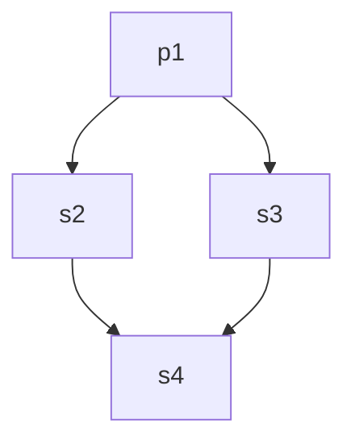

# Asymmetric Lockstep Deadlocks

One of the most elegant architectural properties of SynaFlow is its **strict lockstep execution**. When dealing with streams of data (`Iterator`, `Generator`), SynaFlow will naturally push each item through the DAG node by node, avoiding the accumulation of items in memory.

However, lockstep flow combined with complex DAG topologies (specifically split/join diamonds) can lead to a condition called a **Lockstep Deadlock**.

SynaFlow protects you against this by throwing a `ValueError: Asymmetric lockstep materialization detected` at pipeline build time if it detects a dangerous topological pattern.

This page explains the theory behind this deadlock and how the "Universal Lockstep Rule" protects your streams.

## The Temporal Diamond Problem

Consider a basic Fan-Out / Fan-In "Diamond" topology:
1. `p1` produces a stream of items.
2. `p1` branches into two parallel paths: Path A (`s2`) and Path B (`s3`).
3. Path A and Path B rejoin at a single consumer step `s4`.



In a purely lockstep flow, `s4` needs an item from Path A and an item from Path B to execute.
`p1` produces Item 1, pushes it to `s2` and `s3`. `s4` consumes both, and execution proceeds smoothly.

**What happens if Path A is Eager (materializes), but Path B is purely Lazy (stream)?**

If `s2` requires the entire stream to execute (e.g. `s2` takes a `list[int]`), it becomes a **Materialization Barrier**.

1. `p1` generates Item 1.
2. Path A (`s2`) holds it in memory, waiting for the rest of the stream.
3. Path B (`s3`) receives Item 1 and forwards it to `s4`.
4. `s4` receives Item 1 from Path B. However, `s4` **cannot** execute yet, because it is waiting for the result of Path A (`s2`).
5. Because `s4` is blocked, it stops pulling from Path B.
6. Path B stops pulling from `p1`.
7. `p1` is frozen. `s2` will never receive the rest of the stream.

**Result: Structural Deadlock.** The eager branch demands the stream to finish, but the lazy branch propagates the downstream lock back to the source, halting the stream.

## The Universal Lockstep Rule

To prevent deadlocks without aggressively forcing materialization where it isn't wanted, SynaFlow evaluates your DAG using the **Universal Lockstep Rule** at design time.

Given a stream producer (P) whose stream splits into multiple paths that rejoin at a final consumer (D):

1. **Purely Lazy (Symmetric)**: If NO path contains a materialization barrier, the stream flows in lockstep perfectly. **(VALID)**
2. **Fully Buffered (Symmetric)**: If ALL paths contain at least one materialization node (regardless of where in the path it is), the materialized nodes act as temporal shields. They protect P from the downstream locks of D. **(VALID)**
3. **Asymmetric Paths**: If at least one path is purely lazy AND at least one path contains a materialization barrier, the lazy path will reflect the downstream lock back to P, strangling the eager path. **(INVALID)**

## How to Fix an Asymmetric Pipeline

If SynaFlow throws an `Asymmetric lockstep materialization detected` exception, you have a topology that guarantees a runtime deadlock.

To fix it, you must restore **Symmetry of Barriers**. You have two options:

### 1. Materialize the Source
If you force materialization right at the source (`p1`), the stream ceases to be a stream before it splits. All downstream paths receive the scalar data at the same time.

```python
pipeline(
    steps=[
        step("p1", p1, mode=StepMode.ALL, force_materialize=True),
        step("s2", s2), # Eager
        step("s3", s3), # Lazy
        step("s4", s4),
    ]
)
```

### 2. Materialize the Lazy Paths
You can introduce a materialization barrier into the lazy paths to act as a temporal shield. This allows the source stream to be exhausted smoothly.

```python
pipeline(
    steps=[
        step("p1", p1),
        step("s2", s2), # Inherently Eager (e.g. returns a list)
        step("s3", s3, force_materialize=True), # Forced to be a shield
        step("s4", s4),
    ]
)
```

By enforcing topological symmetry, SynaFlow guarantees that any pipeline you can successfully build will execute safely.
