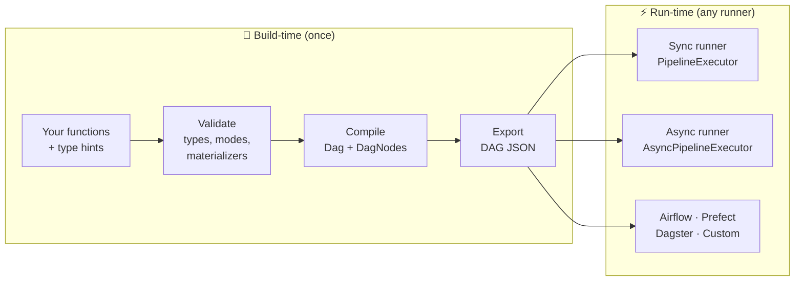

# Build-Time & Run-Time Separation

SynaFlow enforces a strict separation between **compiling the pipeline** and
**executing it**. This is not an implementation detail — it's the architectural
foundation that makes custom runners, cross-orchestrator export, and
deterministic behavior possible.

## The two phases



| Phase | What happens | When | Output |
|---|---|---|---|
| **Build-time** | Type validation, mode resolution, materializer assignment, consumer materialization planning, circular dependency check, sync/async consistency | `pipeline(...)` is called | `Dag` object, serializable JSON |
| **Run-time** | Topological execution, lockstep streaming, bounded handoff via `max_in_flight`, `tee` forking, observer dispatch, error handling, optional `ExecutionOverrides` on top of the compiled contract | `run()` / `async_run()` is called | Step outputs, side effects |

## Why this matters

### 1. The DAG JSON is the contract

Every pipeline exports a deterministic, serializable JSON:

```python
print(p.to_dict())
```

```json
{
  "name": "example",
  "params": {"count": "int"},
  "steps": {
    "producer": {
      "deps": {"count": "int"},
      "output": "Stream[int]",
      "fn": "producer",
      "mode": "all",
      "on_error": "continue",
      "max_in_flight": 1,
      "materializer": "memory_materializer",
      "materialized_deps": [],
      "each_mode_deps": []
    }
  }
}
```

All semantic decisions — mode, `max_in_flight`, `each_mode_deps`,
`materialized_deps`, eager materialization triggered by `OnError.STOP` or
`force_materialize`, and the resolved `node.materializer` callable — are
resolved at build time and frozen in the JSON or `Dag`. Runners don't re-infer
semantics; they execute the contract.

`ExecutionOverrides` fits inside that boundary: it can swap the concrete
runtime callable for a compiled key such as a materializer, observer scope, or
declared runtime resource, but it does not change graph structure, dependency
resolution, or eager-vs-lazy planning.

For nested pipelines, the public key helper is `Scope`, not manual string
concatenation:

```python
from synaflow import ExecutionOverrides, Observer, PIPELINE_SCOPE, Scope

overrides = ExecutionOverrides.empty(p)
sub = Scope("incl")

overrides.resources["db"] = FakeDatabase()
overrides.observers[PIPELINE_SCOPE] = [Observer(noop)]
overrides.observers[sub.scope("validate")] = [Observer(spy)]
overrides.materializers[sub.scope("prepare")] = tuple
```

The executor never understands sub-pipelines directly. `Scope` resolves to the
compiled DAG step key before execution starts, so runtime still operates on the
same flat compiled contract.

For resources, the key space is explicit in the compiled pipeline contract via
`pipeline(resources={...})`. Unlike materializers and observers, resources are
runtime-only: if a pipeline declares one, `run()` / `async_run()` must receive
it via `ExecutionOverrides.resources`, or execution fails loudly.

If you need the operational testing patterns on top of that contract, see
[Testability & Execution Overrides](../advanced/testability.md).

### 2. Write your own runner

The `Dag` object is self-contained. Anyone can write a runner:

```python
from synaflow.core.dag import Dag

class MyRunner:
    def execute(self, dag: Dag, params):
        for level in dag.get_execution_levels():
            for step_name in level:
                node = dag.steps[step_name]
                # resolve dependencies, call node.fn, store output
                ...
```

This is how SynaFlow ships two native runners (sync and async) with identical
semantics, and how you can compile a pipeline into Airflow or Prefect DAGs.

### 3. Deterministic and testable

Because the DAG is a pure data structure, you can assert on it directly:

```python
dag = pipeline(...).dag
assert dag.steps["transformer"].mode == StepMode.EACH
assert dag.get_execution_levels() == [["producer"], ["transformer"], ["consumer"]]
```

The test corpus validates DAG structure and execution output independently —
build-time correctness is verified without running the pipeline.

### 4. No runtime surprises

Type errors, missing dependencies, circular graphs, mode conflicts — all caught
at build time. If `pipeline(...)` succeeds, the DAG is valid. The runner never
needs to check types or resolve ambiguities at runtime.

## Architectural parity

Every domain concern has a symmetric representation in both phases:

| Concern | Build-time | Run-time |
|---|---|---|
| Pipeline/Orchestration | `build_dag()` | `PipelineExecutor` / `AsyncPipelineExecutor` |
| Dependencies | `validate_and_resolve_dependencies()` | Executor reads resolved deps from `node.deps` |
| Topology | `check_circular_dependencies()`, `get_execution_levels()` | Executor iterates `dag.get_execution_levels()` |
| Step compilation | `validate_and_compile_step()` | Executor calls compiled `node.fn` |
| Mode resolution | Resolved at build time → `node.mode` | Executor reads `node.mode`, never re-infers |
| Materialization | Resolved at build time → `node.materializer`, `materialized_deps`, `Dag.needs_materialize(...)` | Executor calls the resolved callable and follows the compiled plan |
| Observers | Normalized at build time → `node.observers` | Executor dispatches events |
| Resources | Declared at build time → `dag.resources` | Executor requires concrete runtime values via `ExecutionOverrides.resources` |

This symmetry means sync and async executors can be completely different
implementations (one uses generators, the other uses `asyncio.Queue`) but
guarantee identical behavior — because they both read the same DAG contract.

## Export to external orchestrators

Because the DAG is self-contained, you can compile a SynaFlow pipeline into
any orchestrator's native format. See [Export Guidance](../advanced/export-guidance.md)
for Airflow, Prefect, and Dagster examples.
