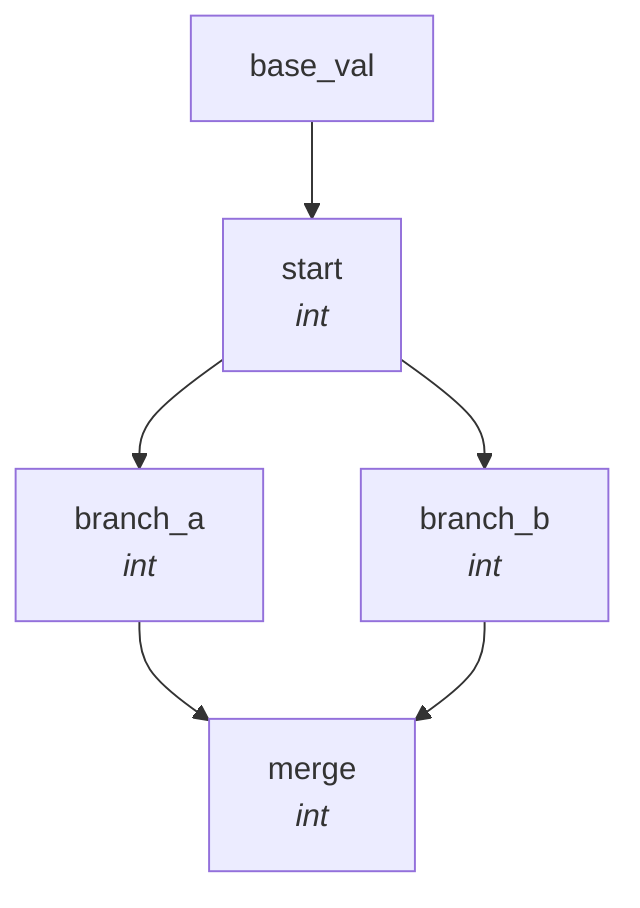
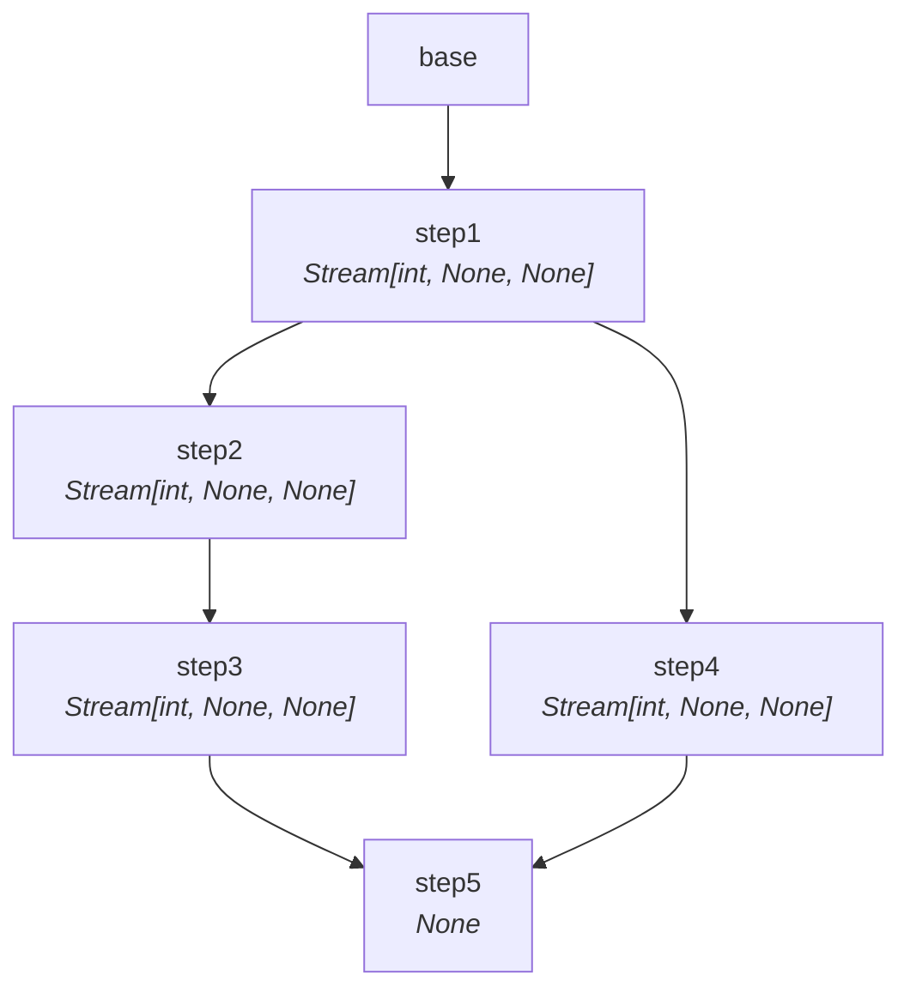

# DAG Construction

SynaFlow builds a Directed Acyclic Graph from your function type hints — no manual wiring.

## How It Works

1. **Parameters** (a `NamedTuple`) become input nodes.
2. Each **step** is inspected — its parameter types are matched against all previously declared outputs.
3. If a match is found, a **dependency edge** is created.
4. The full graph is validated for circular dependencies, type compatibility, and execution mode.

```python
from synaflow import pipeline, step

p = pipeline(
    name="example",
    params=Params,
    steps=[
        step("producer", fn=producer),
        step("transformer", fn=transformer),
        step("consumer", fn=consumer),
    ],
)
```

## The DAG JSON

Every pipeline exports a deterministic JSON representation:

```python
print(p.to_dict())
```

```json
{
  "name": "example",
  "params": {"count": "int"},
  "steps": {
    "producer": {
      "deps": {"count": "int"},
      "output": "Stream[int, None, None]",
      "fn": "producer",
      "mode": "all",
      "on_error": "continue",
      "materializer": "memory_materializer",
      "each_mode_deps": []
    }
  }
}
```

This JSON is the **execution contract** — external runners (Airflow, Prefect,
custom executors) can read it to replicate the DAG without re-inferring
semantics. Dependency edges, mode, and materialization metadata are already
compiled into the graph.

For stream outputs, the important contract is producer-level: the DAG already
decides whether a producer must be materialized before downstream publication.
Executors should consume that decision, not recalculate eager vs lazy behavior
per edge.

## Execution Levels

The DAG is topologically sorted into execution levels — steps at the same level can run in parallel:

```python
dag.get_execution_levels()
# [['producer'], ['transformer'], ['consumer']]
```

## Visualizing the Graph

Use the `scripts/visualize_dag.py` utility to generate Mermaid flowcharts from any pipeline:

### Diamond DAG



### Complex Parallel



## Validation

At build time, SynaFlow validates:

- All dependencies exist and types are compatible.
- No circular dependencies.
- Step modes (`EACH` / `ALL`) are coherent with the data flow.
- Sync and async features are not mixed (a pipeline is either fully sync or fully async).
