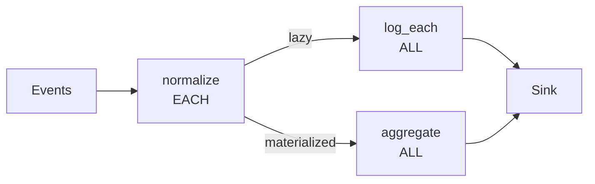

# Event-Based Processing & Idempotency

SynaFlow treats **lazy streaming as the default**. This isn't just about memory
efficiency — it makes the framework naturally suited for event-based processing
and guarantees idempotent pipelines.

## Individual events or time windows — the same pipeline

Because evaluation is lazy, you can process events **one at a time** (streaming)
or **batched in a time window** (materialized) without changing your business logic.

=== "Sync"

    ```python
    from collections.abc import Generator, Iterator
    from synaflow import pipeline, step, run, PipelineRegistry


    class Window(NamedTuple):
        events: list[dict] = [{"id": 1, "amount": 10}, {"id": 2, "amount": 20}]


    # Option 1: process each event individually (EACH mode)
    def normalize(event: dict) -> dict:
        return {**event, "amount": event["amount"] / 100}


    def log_each(normalize: Iterator[dict]) -> None:
        for ev in normalize:
            print(f"Event: {ev}")


    # Option 2: process the entire window at once (ALL mode)
    def aggregate(normalize: list[dict]) -> float:
        return sum(e["amount"] for e in normalize)


    p = pipeline(
        name="event_processor",
        params=Window,
        steps=[
            step("normalize", fn=normalize),  # EACH: one event at a time
            step("log_each", fn=log_each),  # ALL: receives lazy stream
            step("aggregate", fn=aggregate),  # ALL: materializes the window
        ],
    )
    catalog = PipelineRegistry()
    catalog.add(p)

    run(
        catalog.get_dag("event_processor"),
        Window(events=[{"id": 1, "amount": 10}, {"id": 2, "amount": 20}]),
    )
```

=== "Async"

    ```python
    from collections.abc import AsyncGenerator, AsyncIterator
    from synaflow import pipeline, step, async_run, PipelineRegistry


    class Window(NamedTuple):
        events: list[dict] = [{"id": 1, "amount": 10}, {"id": 2, "amount": 20}]


    async def normalize(event: dict) -> dict:
        return {**event, "amount": event["amount"] / 100}


    async def log_each(normalize: AsyncIterator[dict]) -> None:
        async for ev in normalize:
            print(f"Event: {ev}")


    async def aggregate(normalize: list[dict]) -> float:
        return sum(e["amount"] for e in normalize)


    p = pipeline(
        name="event_processor",
        params=Window,
        steps=[
            step("normalize", fn=normalize),
            step("log_each", fn=log_each),
            step("aggregate", fn=aggregate),
        ],
    )
    catalog = PipelineRegistry()
    catalog.add(p)

    async_run(
        catalog.get_dag("event_processor"),
        Window(events=[{"id": 1, "amount": 10}, {"id": 2, "amount": 20}]),
    )
```

The same `normalize` step serves both consumers — `log_each` streams individual
events, `aggregate` materializes the full window. No code duplication.

## Idempotency by default

A pipeline is **idempotent** if running it twice with the same input produces
the same output with the same side effects. SynaFlow's lazy design makes this
natural:

1. **No shared mutable state** between steps — each step is a pure function of
   its declared dependencies.
2. **Deterministic DAG** — the same params always produce the same execution
   plan. The DAG JSON is a verifiable, serializable contract.
3. **Error tolerance** — with `OnError.CONTINUE` (the default), a failing event
   is discarded without halting the stream. The remaining events continue
   unchanged.

=== "Sync"

    ```python
    from synaflow import pipeline, step, run, OnError, PipelineRegistry


    def process(event: dict) -> dict:
        if event.get("corrupt"):
            raise ValueError("skipping corrupt event")
        return {**event, "processed": True}


    def sink(process: Iterator[dict]) -> None:
        for ev in process:
            print(f"Stored: {ev}")


    p = pipeline(
        name="idempotent",
        params=type("P", (NamedTuple,), {}),
        steps=[
            step("process", fn=process, on_error=OnError.CONTINUE),
            step("sink", fn=sink),
        ],
    )
    catalog = PipelineRegistry()
    catalog.add(p)
```

=== "Async"

    ```python
    from synaflow import pipeline, step, async_run, OnError, PipelineRegistry


    async def process(event: dict) -> dict:
        if event.get("corrupt"):
            raise ValueError("skipping corrupt event")
        return {**event, "processed": True}


    async def sink(process: AsyncIterator[dict]) -> None:
        async for ev in process:
            print(f"Stored: {ev}")


    p = pipeline(
        name="idempotent",
        params=type("P", (NamedTuple,), {}),
        steps=[
            step("process", fn=process, on_error=OnError.CONTINUE),
            step("sink", fn=sink),
        ],
    )
    catalog = PipelineRegistry()
    catalog.add(p)
```

Re-run with the same events and you get the same results. The corrupt one is
silently discarded both times.

## Re-processing past events

When you need to re-process historical events (audit, backfill, bug fix), you
can:

- **Individually:** push each past event through as a stream, using the same
  EACH-mode pipeline. No batch overhead.
- **As a window:** collect them into a time window, materialize, and process
  with ALL-mode steps. Better for aggregations and analytics.
- **Mixed:** reprocess individually but also materialize a summary for audit.

```python
# Re-process a week of events individually
for event in fetch_events(start="2026-06-01", end="2026-06-07"):
    run(catalog.get_dag("event_processor"), Params(events=[event]))

# Same week, but aggregate the daily windows
for day in range(1, 8):
    batch = fetch_events(start=f"2026-06-{day:02d}")
    run(catalog.get_dag("event_processor"), Params(events=batch))
```

The pipeline definition doesn't change — only the input.

## Lazy default preserves CPU and RAM

Because SynaFlow defaults to lazy streaming (`OnError.CONTINUE`), a failing
event is discarded immediately without loading the full batch into memory.
This is critical for high-throughput event systems where you can't afford to
halt the pipeline or materialize everything just to handle one failure.



The same producer feeds two consumers with different memory profiles — one
lazy, one materialized. Idempotent, efficient, and zero code duplication.
