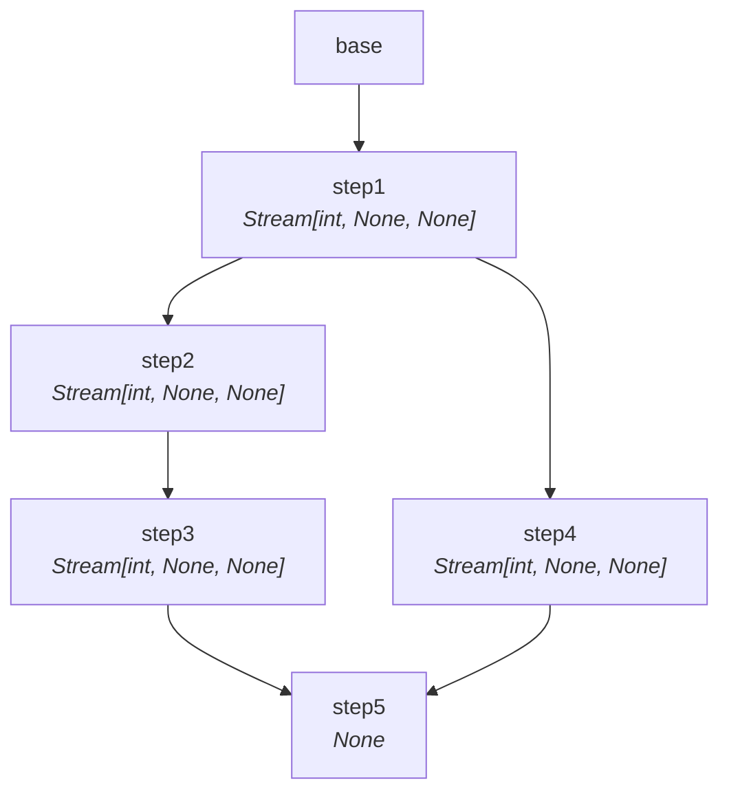
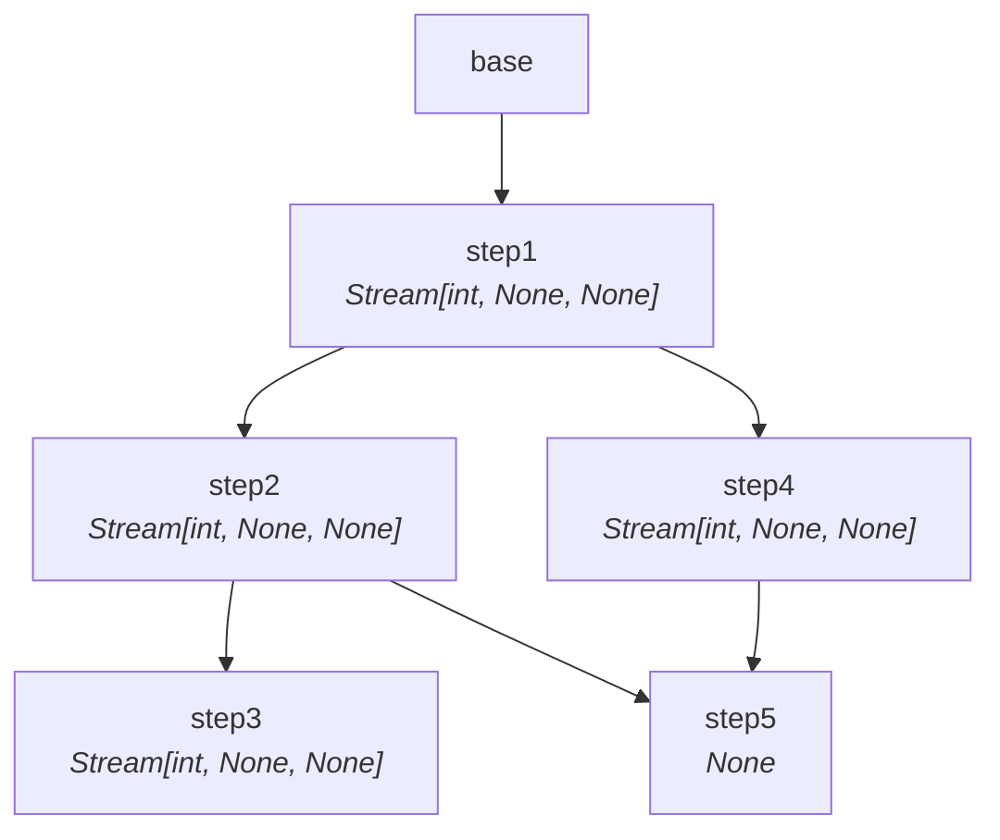
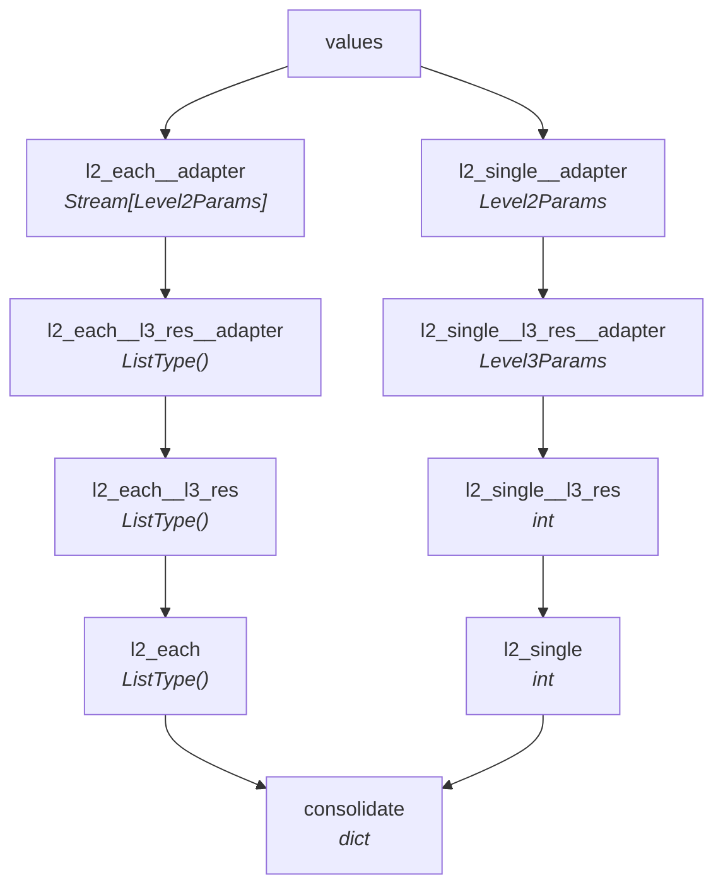
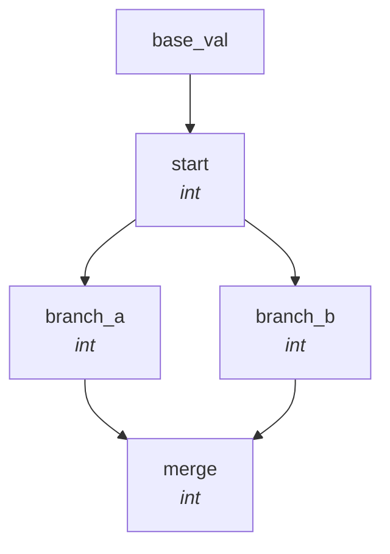
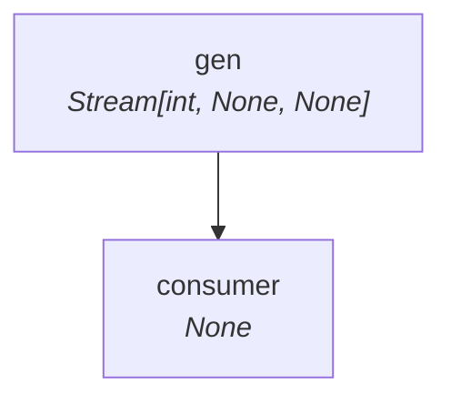
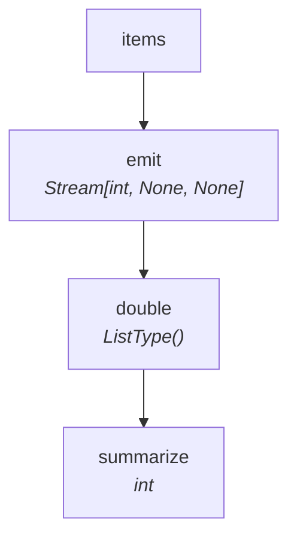
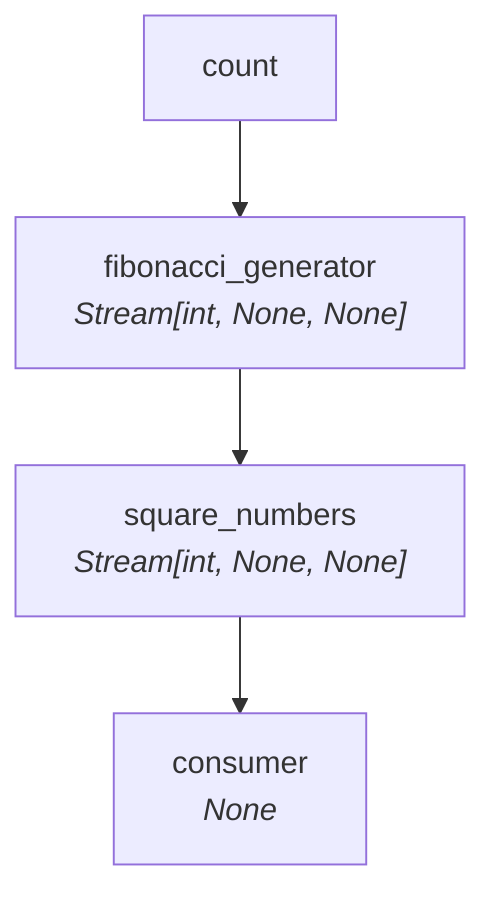
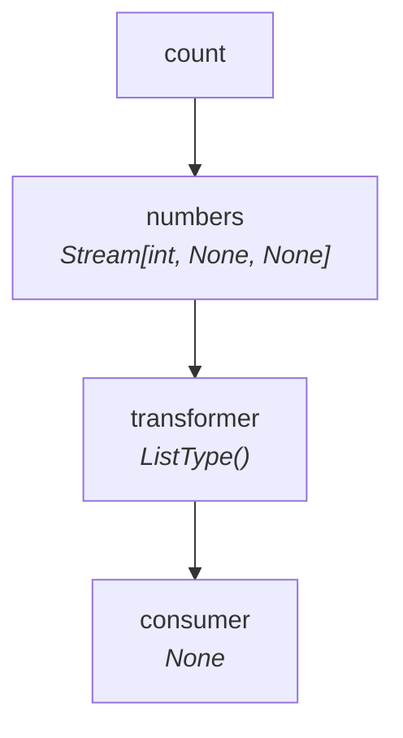
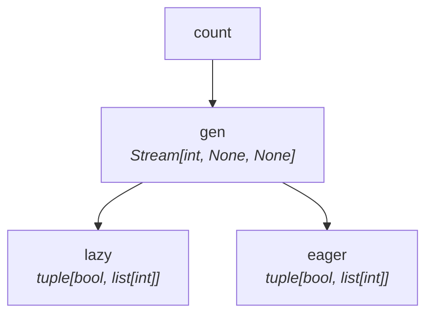
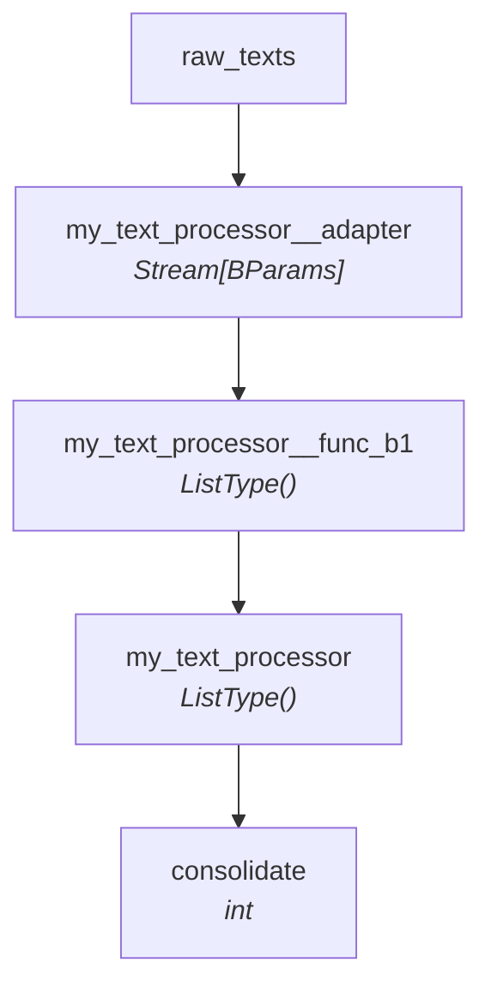

# Examples

Every SynaFlow pipeline can be visualized with [`scripts/visualize_dag.py`](https://github.com/humansoftware/synaflow/blob/main/scripts/visualize_dag.py).

## complex_parallel

=== "Sync"

    ```python
    from collections.abc import Generator, Iterator
    from typing import NamedTuple
    
    from synaflow import pipeline, step
    
    
    class ComplexParallelParams(NamedTuple):
        base: int = 1
    
    
    def step1(base: int) -> Generator[int, None, None]:
        for i in range(5):
            yield base + i
    
    
    def step2(step1: Iterator[int]) -> Generator[int, None, None]:
        for x in step1:
            yield x * 10
    
    
    def step3(step2: Iterator[int]) -> Generator[int, None, None]:
        for x in step2:
            yield x + 1
    
    
    def step4(step1: Iterator[int]) -> Generator[int, None, None]:
        for x in step1:
            yield x * 100
    
    
    def step5(step3: Iterator[int], step4: Iterator[int]) -> None:
        pass
    
    
    # Topology:
    # step1 -> step2 -> step3 \
    #       -> step4 --------> step5
    
    ```

=== "Async"

    ```python
    from collections.abc import AsyncGenerator, AsyncIterator
    from typing import NamedTuple
    
    from synaflow import pipeline, step
    
    
    class ComplexParallelParams(NamedTuple):
        base: int = 1
    
    
    async def step1(base: int) -> AsyncGenerator[int, None, None]:
        for i in range(5):
            yield base + i
    
    
    async def step2(step1: AsyncIterator[int]) -> AsyncGenerator[int, None, None]:
        async for x in step1:
            yield x * 10
    
    
    async def step3(step2: AsyncIterator[int]) -> AsyncGenerator[int, None, None]:
        async for x in step2:
            yield x + 1
    
    
    async def step4(step1: AsyncIterator[int]) -> AsyncGenerator[int, None, None]:
        async for x in step1:
            yield x * 100
    
    
    async def step5(step3: AsyncIterator[int], step4: AsyncIterator[int]) -> None:
        pass
    
    
    # Topology:
    # step1 -> step2 -> step3 \
    #       -> step4 --------> step5
    
    ```

[:fontawesome-brands-github: Sync source](https://github.com/humansoftware/synaflow/blob/main//home/mvallebr/git/synaflow/tests/execution/sync_engine/corpus/complex_parallel.py) | [:fontawesome-brands-github: Async source](https://github.com/humansoftware/synaflow/blob/main//home/mvallebr/git/synaflow/tests/execution/async_engine/corpus/complex_parallel.py)




## complex_parallel_mixed

=== "Sync"

    ```python
    from collections.abc import Generator, Iterator
    from typing import NamedTuple
    
    from synaflow import pipeline, step
    
    
    class ComplexParallelMixedParams(NamedTuple):
        base: int = 1
    
    
    def step1(base: int) -> Generator[int, None, None]:
        for i in range(5):
            yield base + i
    
    
    def step2(step1: Iterator[int]) -> Generator[int, None, None]:
        for x in step1:
            yield x * 10
    
    
    def step3(step2: Iterator[int]) -> Generator[int, None, None]:
        for x in step2:
            yield x + 1
    
    
    def step4(step1: Iterator[int]) -> Generator[int, None, None]:
        for x in step1:
            yield x * 100
    
    
    def step5(step2: Iterator[int], step4: Iterator[int]) -> None:
        pass
    
    
    # Topology:
    # step1 -> step2 -> step3
    #       \       \
    #        \       -> step5
    #         -> step4 /
    
    ```

=== "Async"

    ```python
    from collections.abc import AsyncGenerator, AsyncIterator
    from typing import NamedTuple
    
    from synaflow import pipeline, step
    
    
    class ComplexParallelMixedParams(NamedTuple):
        base: int = 1
    
    
    async def step1(base: int) -> AsyncGenerator[int, None, None]:
        for i in range(5):
            yield base + i
    
    
    async def step2(step1: AsyncIterator[int]) -> AsyncGenerator[int, None, None]:
        async for x in step1:
            yield x * 10
    
    
    async def step3(step2: AsyncIterator[int]) -> AsyncGenerator[int, None, None]:
        async for x in step2:
            yield x + 1
    
    
    async def step4(step1: AsyncIterator[int]) -> AsyncGenerator[int, None, None]:
        async for x in step1:
            yield x * 100
    
    
    async def step5(step2: AsyncIterator[int], step4: AsyncIterator[int]) -> None:
        pass
    
    
    # Topology:
    # step1 -> step2 -> step3
    #       \       \
    #        \       -> step5
    #         -> step4 /
    
    ```

[:fontawesome-brands-github: Sync source](https://github.com/humansoftware/synaflow/blob/main//home/mvallebr/git/synaflow/tests/execution/sync_engine/corpus/complex_parallel_mixed.py) | [:fontawesome-brands-github: Async source](https://github.com/humansoftware/synaflow/blob/main//home/mvallebr/git/synaflow/tests/execution/async_engine/corpus/complex_parallel_mixed.py)




## deep_sub_pipelines

=== "Sync"

    ```python
    from typing import Iterator, NamedTuple
    
    from synaflow import include, pipeline, step
    
    ```

=== "Async"

    ```python
    from typing import AsyncIterator, NamedTuple
    
    from synaflow import include, pipeline, step
    
    ```

[:fontawesome-brands-github: Sync source](https://github.com/humansoftware/synaflow/blob/main//home/mvallebr/git/synaflow/tests/execution/sync_engine/corpus/deep_sub_pipelines.py) | [:fontawesome-brands-github: Async source](https://github.com/humansoftware/synaflow/blob/main//home/mvallebr/git/synaflow/tests/execution/async_engine/corpus/deep_sub_pipelines.py)




## diamond

=== "Sync"

    ```python
    from typing import NamedTuple
    
    from synaflow import pipeline, step
    
    
    class DiamondParams(NamedTuple):
        base_val: int = 10
    
    
    def start(base_val: int) -> int:
        return base_val
    
    
    def branch_a(start: int) -> int:
        return start + 1
    
    
    def branch_b(start: int) -> int:
        return start + 2
    
    
    def merge(branch_a: int, branch_b: int) -> int:
        return branch_a + branch_b
    
    ```

=== "Async"

    ```python
    from typing import NamedTuple
    
    from synaflow import pipeline, step
    
    
    class DiamondParams(NamedTuple):
        base_val: int = 10
    
    
    async def start(base_val: int) -> int:
        return base_val
    
    
    async def branch_a(start: int) -> int:
        return start + 1
    
    
    async def branch_b(start: int) -> int:
        return start + 2
    
    
    async def merge(branch_a: int, branch_b: int) -> int:
        return branch_a + branch_b
    
    ```

[:fontawesome-brands-github: Sync source](https://github.com/humansoftware/synaflow/blob/main//home/mvallebr/git/synaflow/tests/execution/sync_engine/corpus/diamond.py) | [:fontawesome-brands-github: Async source](https://github.com/humansoftware/synaflow/blob/main//home/mvallebr/git/synaflow/tests/execution/async_engine/corpus/diamond.py)




## error_handling

=== "Sync"

    ```python
    from collections.abc import Generator, Iterator
    from typing import NamedTuple
    from synaflow import pipeline, step
    
    
    class ErrorHandlingParams(NamedTuple):
        pass
    
    
    errors_list = []
    
    
    def custom_error_handler(exc: BaseException) -> None:
        errors_list.append(str(exc))
    
    
    def custom_err_mat(ctx):
        return custom_error_handler
    
    
    def gen() -> Generator[int, None, None]:
        yield 1
        raise ValueError("gen failed")
    
    
    def consumer(gen: Iterator[int]) -> None:
        for x in gen:
            pass
    
    ```

=== "Async"

    ```python
    from collections.abc import AsyncGenerator, AsyncIterator
    from typing import NamedTuple
    from synaflow import pipeline, step
    
    
    class ErrorHandlingParams(NamedTuple):
        pass
    
    
    errors_list = []
    
    
    def custom_error_handler(exc: BaseException) -> None:
        errors_list.append(str(exc))
    
    
    def custom_err_mat(ctx):
        return custom_error_handler
    
    
    async def gen() -> AsyncGenerator[int, None]:
        yield 1
        raise ValueError("gen failed")
    
    
    async def consumer(gen: AsyncIterator[int]) -> None:
        async for x in gen:
            pass
    
    ```

[:fontawesome-brands-github: Sync source](https://github.com/humansoftware/synaflow/blob/main//home/mvallebr/git/synaflow/tests/execution/sync_engine/corpus/error_handling.py) | [:fontawesome-brands-github: Async source](https://github.com/humansoftware/synaflow/blob/main//home/mvallebr/git/synaflow/tests/execution/async_engine/corpus/error_handling.py)




## explicit_modes

=== "Sync"

    ```python
    from collections.abc import Generator
    from typing import NamedTuple
    
    from synaflow import StepMode, pipeline, step
    
    ```

=== "Async"

    ```python
    from collections.abc import AsyncGenerator
    from typing import NamedTuple
    
    from synaflow import StepMode, pipeline, step
    
    ```

[:fontawesome-brands-github: Sync source](https://github.com/humansoftware/synaflow/blob/main//home/mvallebr/git/synaflow/tests/execution/sync_engine/corpus/explicit_modes.py) | [:fontawesome-brands-github: Async source](https://github.com/humansoftware/synaflow/blob/main//home/mvallebr/git/synaflow/tests/execution/async_engine/corpus/explicit_modes.py)




## fibonacci

=== "Sync"

    ```python
    from collections.abc import Generator, Iterator
    from typing import NamedTuple
    
    from synaflow import pipeline, step
    
    
    class FibonacciParams(NamedTuple):
        count: int = 10
    
    
    def fibonacci_generator(count: int) -> Generator[int, None, None]:
        a, b = 0, 1
        for _ in range(count):
            yield a
            a, b = b, a + b
    
    
    def square_numbers(fibonacci_generator: Iterator[int]) -> Generator[int, None, None]:
        for x in fibonacci_generator:
            yield x * x
    
    
    def consumer(square_numbers: Iterator[int]) -> None:
        pass
    
    ```

=== "Async"

    ```python
    from collections.abc import AsyncGenerator, AsyncIterator
    from typing import NamedTuple
    
    from synaflow import pipeline, step
    
    
    class FibonacciParams(NamedTuple):
        count: int = 10
    
    
    async def fibonacci_generator(count: int) -> AsyncGenerator[int, None, None]:
        a, b = 0, 1
        for _ in range(count):
            yield a
            a, b = b, a + b
    
    
    async def square_numbers(
        fibonacci_generator: AsyncIterator[int],
    ) -> AsyncGenerator[int, None, None]:
        async for x in fibonacci_generator:
            yield x * x
    
    
    async def consumer(square_numbers: AsyncIterator[int]) -> None:
        pass
    
    ```

[:fontawesome-brands-github: Sync source](https://github.com/humansoftware/synaflow/blob/main//home/mvallebr/git/synaflow/tests/execution/sync_engine/corpus/fibonacci.py) | [:fontawesome-brands-github: Async source](https://github.com/humansoftware/synaflow/blob/main//home/mvallebr/git/synaflow/tests/execution/async_engine/corpus/fibonacci.py)




## linear

=== "Sync"

    ```python
    from collections.abc import Generator, Iterator
    from typing import NamedTuple
    
    from synaflow import Observer, pipeline, step
    
    
    class LinearParams(NamedTuple):
        count: int = 3
    
    
    def numbers(count: int) -> Generator[int, None, None]:
        yield from range(count)
    
    
    def transformer(number: int) -> int:
        return number * 2
    
    
    def consumer(transformer: Iterator[int]) -> None:
        for x in transformer:
            pass
    
    ```

=== "Async"

    ```python
    from collections.abc import AsyncGenerator, AsyncIterator
    from typing import NamedTuple
    
    from synaflow import pipeline, step
    
    
    class LinearParams(NamedTuple):
        count: int = 3
    
    
    async def numbers(count: int) -> AsyncGenerator[int, None, None]:
        for _i in range(count):
            yield _i
    
    
    async def transformer(number: int) -> int:
        return number * 2
    
    
    async def consumer(transformer: AsyncIterator[int]) -> None:
        async for x in transformer:
            pass
    
    ```

[:fontawesome-brands-github: Sync source](https://github.com/humansoftware/synaflow/blob/main//home/mvallebr/git/synaflow/tests/execution/sync_engine/corpus/linear.py) | [:fontawesome-brands-github: Async source](https://github.com/humansoftware/synaflow/blob/main//home/mvallebr/git/synaflow/tests/execution/async_engine/corpus/linear.py)




## mixed_fanout

=== "Sync"

    ```python
    from collections.abc import Generator, Iterator
    from typing import NamedTuple
    
    from synaflow import pipeline, step
    
    ```

=== "Async"

    ```python
    from collections.abc import AsyncGenerator, AsyncIterator
    from typing import NamedTuple
    
    from synaflow import pipeline, step
    
    ```

[:fontawesome-brands-github: Sync source](https://github.com/humansoftware/synaflow/blob/main//home/mvallebr/git/synaflow/tests/execution/sync_engine/corpus/mixed_fanout.py) | [:fontawesome-brands-github: Async source](https://github.com/humansoftware/synaflow/blob/main//home/mvallebr/git/synaflow/tests/execution/async_engine/corpus/mixed_fanout.py)




## sub_pipelines

=== "Sync"

    ```python
    from typing import Iterator, NamedTuple
    
    from synaflow import include, pipeline, step
    
    
    class BParams(NamedTuple):
        text: str
    
    
    def func_b1(text: str) -> str:
        return text.upper()
    
    
    def func_b2(func_b1: str) -> int:
        return len(func_b1)
    
    
    pipe_b = pipeline(
        name="TextProcessor",
        params=BParams,
        exports="func_b2",
        steps=[step("func_b1", fn=func_b1), step("func_b2", fn=func_b2)],
    )
    
    
    class AParams(NamedTuple):
        raw_texts: list[str]
    
    
    def prepare_b_each(raw_texts: list[str]) -> Iterator[BParams]:
        for t in raw_texts:
            yield BParams(text=t)
    
    
    def consolidate(my_text_processor: list[int]) -> int:
        return sum(my_text_processor)
    
    
    pipe = pipeline(
        name="MainPipeline",
        params=AParams,
        steps=[
            include("my_text_processor", pipeline=pipe_b, fn=prepare_b_each),
            step("consolidate", fn=consolidate),
        ],
    )
    
    ```

=== "Async"

    ```python
    from typing import AsyncIterator, NamedTuple
    
    from synaflow import include, pipeline, step
    
    
    class BParams(NamedTuple):
        text: str
    
    
    async def func_b1(text: str) -> str:
        return text.upper()
    
    
    async def func_b2(func_b1: str) -> int:
        return len(func_b1)
    
    
    pipe_b = pipeline(
        name="TextProcessor",
        params=BParams,
        exports="func_b2",
        steps=[step("func_b1", fn=func_b1), step("func_b2", fn=func_b2)],
    )
    
    
    class AParams(NamedTuple):
        raw_texts: list[str]
    
    
    async def prepare_b_each(raw_texts: list[str]) -> AsyncIterator[BParams]:
        for t in raw_texts:
            yield BParams(text=t)
    
    
    async def consolidate(my_text_processor: list[int]) -> int:
        return sum(my_text_processor)
    
    
    pipe = pipeline(
        name="MainPipeline",
        params=AParams,
        steps=[
            include("my_text_processor", pipeline=pipe_b, fn=prepare_b_each),
            step("consolidate", fn=consolidate),
        ],
    )
    
    ```

[:fontawesome-brands-github: Sync source](https://github.com/humansoftware/synaflow/blob/main//home/mvallebr/git/synaflow/tests/execution/sync_engine/corpus/sub_pipelines.py) | [:fontawesome-brands-github: Async source](https://github.com/humansoftware/synaflow/blob/main//home/mvallebr/git/synaflow/tests/execution/async_engine/corpus/sub_pipelines.py)




---
*Diagrams auto-generated from the test corpus.*
