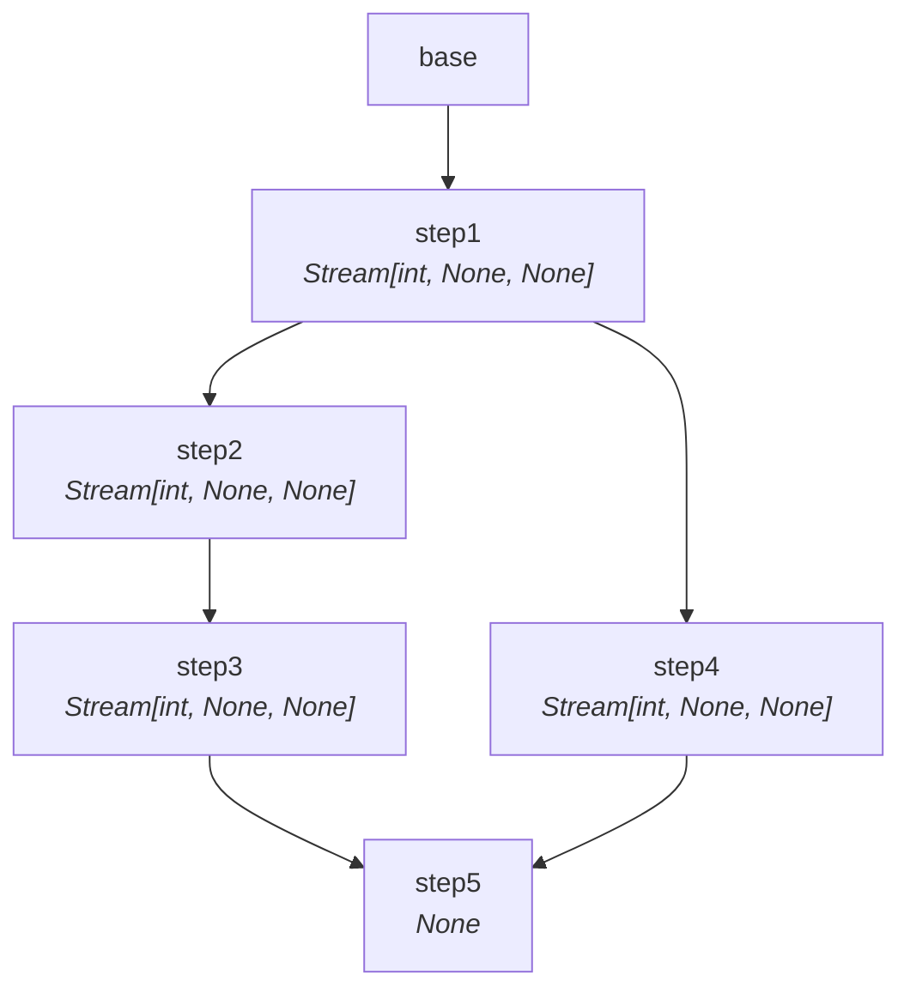
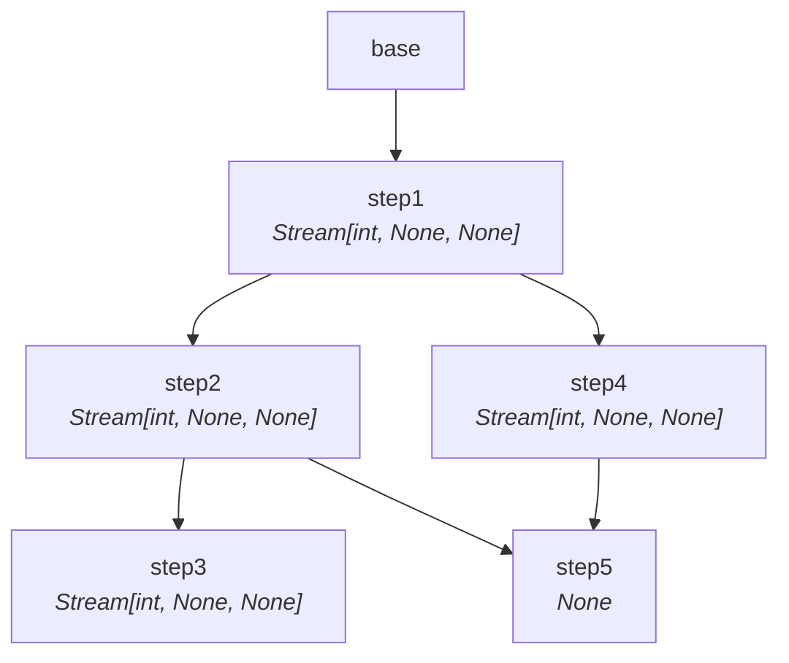
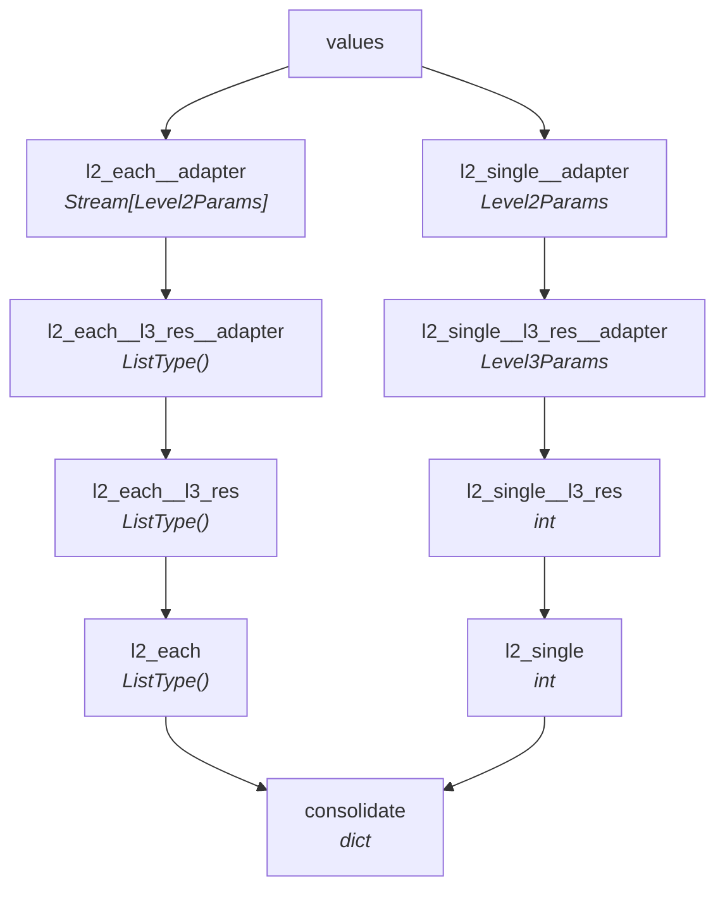
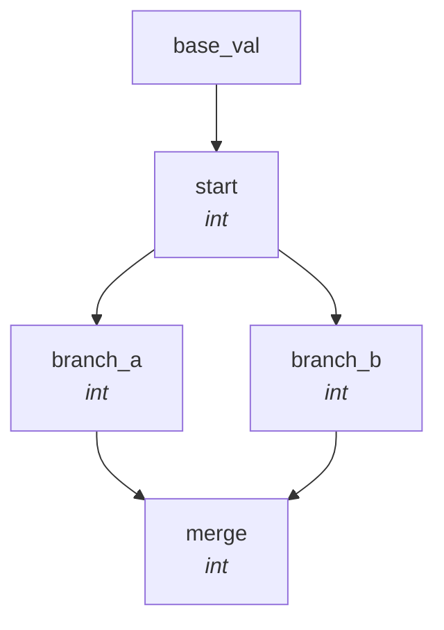
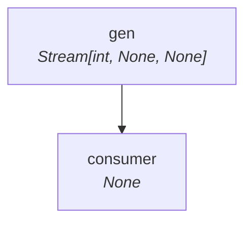
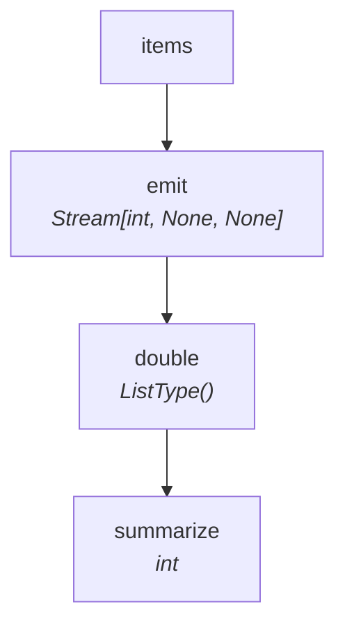
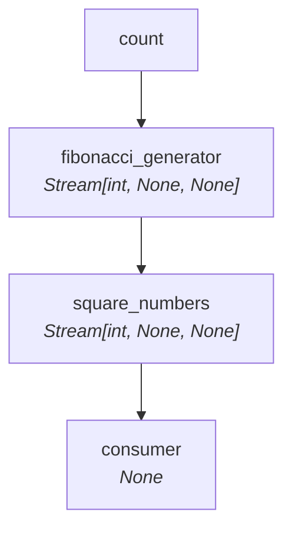
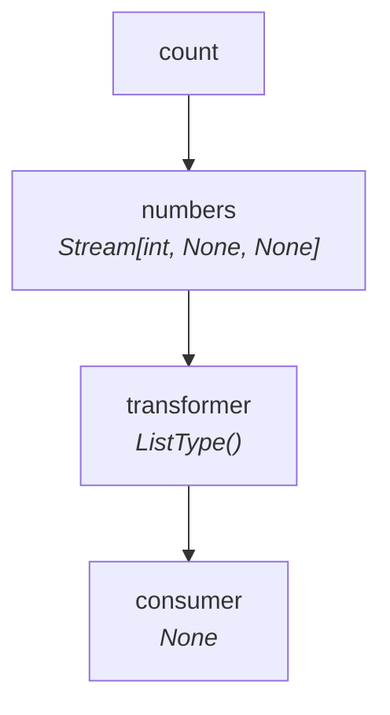
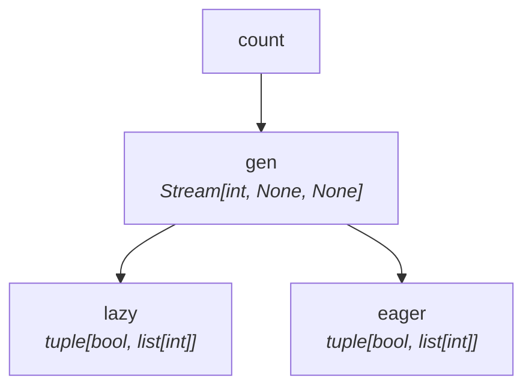
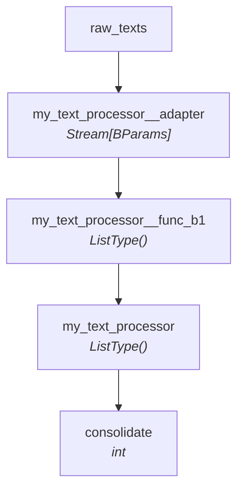

# Examples

Every SynaFlow pipeline can be visualized with [`scripts/visualize_dag.py`](https://github.com/humansoftware/synaflow/blob/main/scripts/visualize_dag.py).

## complex_parallel

[:fontawesome-brands-github: Source](https://github.com/humansoftware/synaflow/blob/main/tests/execution/sync_engine/corpus/complex_parallel.py)

## complex_parallel_mixed

[:fontawesome-brands-github: Source](https://github.com/humansoftware/synaflow/blob/main/tests/execution/sync_engine/corpus/complex_parallel_mixed.py)

## deep_sub_pipelines

[:fontawesome-brands-github: Source](https://github.com/humansoftware/synaflow/blob/main/tests/execution/sync_engine/corpus/deep_sub_pipelines.py)

## diamond

[:fontawesome-brands-github: Source](https://github.com/humansoftware/synaflow/blob/main/tests/execution/sync_engine/corpus/diamond.py)

## error_handling

[:fontawesome-brands-github: Source](https://github.com/humansoftware/synaflow/blob/main/tests/execution/sync_engine/corpus/error_handling.py)

## explicit_modes

[:fontawesome-brands-github: Source](https://github.com/humansoftware/synaflow/blob/main/tests/execution/sync_engine/corpus/explicit_modes.py)

## fibonacci

[:fontawesome-brands-github: Source](https://github.com/humansoftware/synaflow/blob/main/tests/execution/sync_engine/corpus/fibonacci.py)

## linear

[:fontawesome-brands-github: Source](https://github.com/humansoftware/synaflow/blob/main/tests/execution/sync_engine/corpus/linear.py)

## mixed_fanout

[:fontawesome-brands-github: Source](https://github.com/humansoftware/synaflow/blob/main/tests/execution/sync_engine/corpus/mixed_fanout.py)

## sub_pipelines

[:fontawesome-brands-github: Source](https://github.com/humansoftware/synaflow/blob/main/tests/execution/sync_engine/corpus/sub_pipelines.py)

---
*Diagrams auto-generated from the test corpus.*
