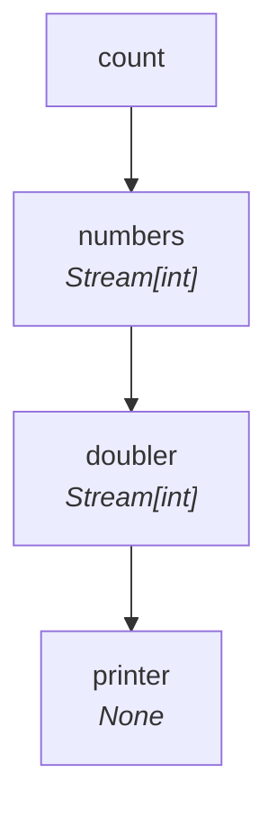
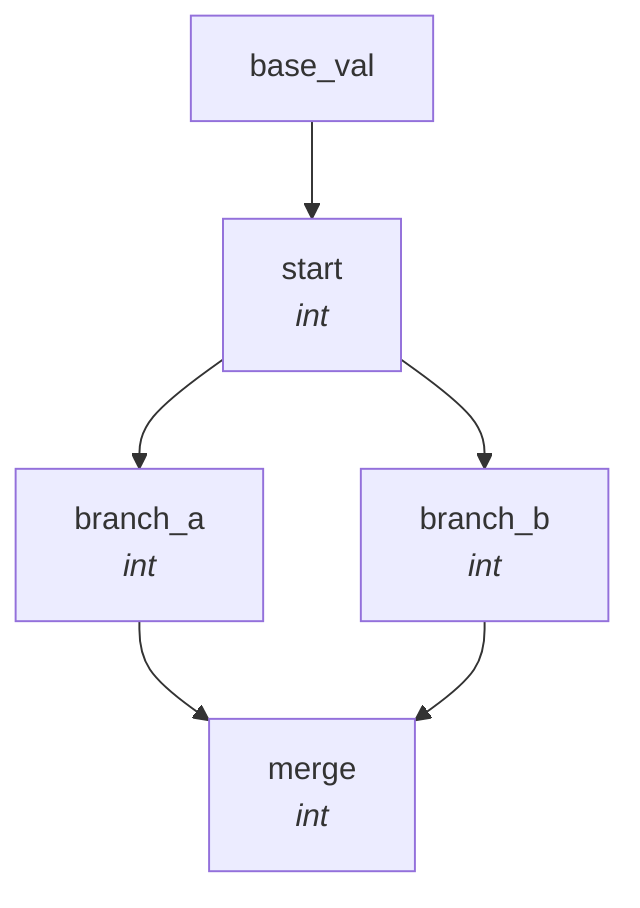

# How the DAG is Wired

SynaFlow reads your function signatures and builds a dependency graph **automatically**.
There is no manual wiring. This page explains exactly how the mapping works.

## A Minimal Pipeline

=== "Sync"

    ```python
    from collections.abc import Generator, Iterator
    from typing import NamedTuple
    from synaflow import pipeline, step, run

    class Params(NamedTuple):
        count: int = 3

    def numbers(count: int) -> Generator[int, None, None]:
        yield from range(count)

    def doubler(numbers: Iterator[int]) -> Generator[int, None, None]:
        for x in numbers:
            yield x * 2

    def printer(doubler: int) -> None:
        print(doubler)

    p = pipeline(
        name="basic_example",
        params=Params,
        steps=[
            step("numbers", fn=numbers),
            step("doubler", fn=doubler),
            step("printer", fn=printer),
        ],
    )
    ```

=== "Async"

    ```python
    from collections.abc import AsyncGenerator, AsyncIterator
    from typing import NamedTuple
    from synaflow import pipeline, step, async_run

    class Params(NamedTuple):
        count: int = 3

    async def numbers(count: int) -> AsyncGenerator[int, None]:
        for i in range(count):
            yield i

    async def doubler(numbers: AsyncIterator[int]) -> AsyncGenerator[int, None]:
        async for x in numbers:
            yield x * 2

    async def printer(doubler: int) -> None:
        print(doubler)

    p = pipeline(
        name="basic_example",
        params=Params,
        steps=[
            step("numbers", fn=numbers),
            step("doubler", fn=doubler),
            step("printer", fn=printer),
        ],
    )
    ```

This pipeline generates the following DAG:



Let's break down **how** SynaFlow built this graph.

---

## Rule 1: The Step Name = The Dataset

Every `step()` declaration creates a **node** in the DAG and a **dataset** that
holds the step's output. The dataset name is the step's name.

```python
step("numbers", fn=numbers)   # creates dataset "numbers"
step("doubler", fn=doubler)   # creates dataset "doubler"
step("printer", fn=printer)   # creates dataset "printer"
```

Any downstream step can reference these datasets.

---

## Rule 2: The Parameter Name = The Dependency

When SynaFlow inspects a function's signature, each **parameter name** is matched
against all existing datasets (prior steps and pipeline params). If a dataset
with the same name exists, a **dependency edge** is created.

```python
def doubler(numbers: Iterator[int]) -> ...:
#           ^^^^^^^
#           Matches dataset "numbers" → dependency created
```

If no dataset matches, the pipeline fails at build time:

```python
def doubler(wrong_name: Iterator[int]) -> ...:
#           ^^^^^^^^^^
#           ❌ ValueError: no prior step or param produces 'wrong_name'
```

### Smart Binding

Parameter names don't need to match exactly — they only need the same
**Base Dataset Name** (absolute plural form). The step named `items` can be
referenced as `item` (singular) or `items_list` (suffixed).

```python
def transform(item: int) -> ...:
#           ^^^^
#           get_base_dataset_name("item") == "items" → matches step "items"
```

This is covered in detail in [Semantic Naming](../core-concepts/semantic-naming.md).

---

## Rule 3: The Type Hint = The Contract

The parameter's **type annotation** tells SynaFlow *how* the data should be
delivered. This determines the **execution mode**:

| Parameter type | Producer type | Mode | Behavior |
|---|---|---|---|
| `T` (scalar) | `Iterator[T]` | **EACH** | Called once per item |
| `Iterator[T]` | `Iterator[T]` | **ALL** | Receives the lazy stream |
| `list[T]` | `Iterator[T]` | **ALL** | Stream materialized to a list |

In our example:

```python
def numbers(count: int) -> Generator[int, None, None]:
#           ^^^                                              ← from Params (input)
#                        ^^^^^^^^^^^^^^^^^^^^^^^^^           ← produces Iterator[int]

def doubler(numbers: Iterator[int]) -> Generator[int, None, None]:
#           ^^^^^^^^^^^^^^^^^^^^^^   ← parameter type = Iterator[int]
#                                     ← producer type = Iterator[int]
#                                     ← both are streams → ALL mode, lazy pass-through

def printer(doubler: int) -> None:
#           ^^^^^^^                ← parameter type = int (scalar)
#                                   ← producer type = Iterator[int] (from doubler)
#                                   ← scalar consumer + stream producer → EACH mode
```

**`printer` runs in EACH mode** because it asks for a scalar `int` but receives
from a `Generator[int]`. SynaFlow unrolls the stream and calls `printer` once
for every item the `doubler` yields.

---

## Rule 4: Pipeline Params = Global Inputs

Every field in the `NamedTuple` passed as `params` becomes a global input node
accessible to any step by name:

```python
class Params(NamedTuple):
    count: int = 3        # ← creates input node "count" with type int

def numbers(count: int) -> ...:
#           ^^^^^           ← matches "count" from Params
```

---

## Rule 5: The Execution Order = Topological Sort

SynaFlow computes the **execution levels** from the dependency graph.
Steps at the same level have no dependencies on each other and could run in parallel.

```
Level 0: [numbers]          ← depends only on params
Level 1: [doubler]          ← depends on numbers
Level 2: [printer]          ← depends on doubler
```

For a diamond topology:



```
Level 0: [start]                     ← depends on param
Level 1: [branch_a, branch_b]        ← both depend only on start → can be parallel
Level 2: [merge]                     ← depends on branch_a AND branch_b
```

---

## Summary

```
   step("name", fn=func)           def func(param: Type) -> OutputType
        │                                    │              │
        ▼                                    ▼              ▼
   Dataset "name"                   Dependency on       Determines EACH/ALL
   holds output                    dataset "param"      and output type
```

With these three pieces — **step name**, **parameter name**, and **type hint** —
SynaFlow builds the entire DAG without a single line of manual wiring.

## Next

Now that you understand the wiring, see how [Lockstep Data Flow](lockstep-flow.md)
uses this structure to achieve extreme memory efficiency, and how
[Max In Flight](max-in-flight.md) adds a bounded ahead window for I/O-bound
streaming patterns.
