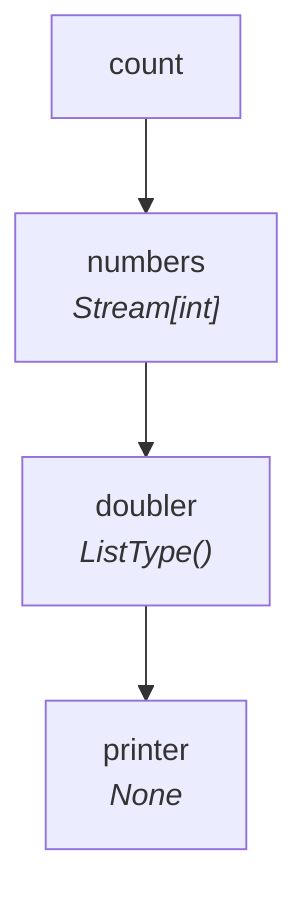
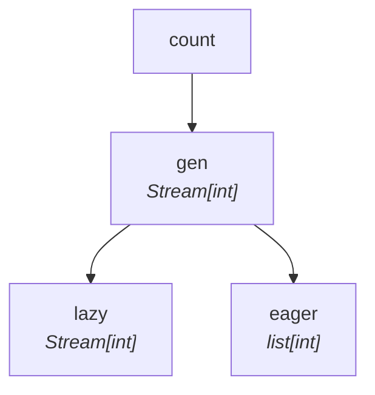

# Lockstep Data Flow

SynaFlow's streaming engine guarantees **extreme memory efficiency** by processing
pipelines in lockstep — one item flows entirely through the DAG before the next
item is produced.

This is the default behavior because every step starts with
`max_in_flight=1`. If you need a bounded window between two stages, see
[Max In Flight](max-in-flight.md).

## A Streaming Pipeline

=== "Sync"

    ```python
    from collections.abc import Generator, Iterator
    from typing import NamedTuple
    from synaflow import pipeline, step, run

    class Params(NamedTuple):
        count: int = 3

    def numbers(count: int) -> Generator[int, None, None]:
        yield from range(count)

    def doubler(number: int) -> int:
        return number * 2

    def printer(doubler: Iterator[int]) -> None:
        for x in doubler:
            print(f"Consumed: {x}")

    p = pipeline(
        name="lockstep_demo",
        params=Params,
        steps=[
            step("numbers", fn=numbers),
            step("doubler", fn=doubler),
            step("printer", fn=printer),
        ],
    )

    run(p, Params(count=5))
    ```

=== "Async"

    ```python
    from collections.abc import AsyncGenerator, AsyncIterator
    from typing import NamedTuple
    from synaflow import pipeline, step, async_run

    class Params(NamedTuple):
        count: int = 3

    async def numbers(count: int) -> AsyncGenerator[int, None]:
        for i in range(count):
            yield i

    async def doubler(number: int) -> int:
        return number * 2

    async def printer(doubler: AsyncIterator[int]) -> None:
        async for x in doubler:
            print(f"Consumed: {x}")

    p = pipeline(
        name="lockstep_demo",
        params=Params,
        steps=[
            step("numbers", fn=numbers),
            step("doubler", fn=doubler),
            step("printer", fn=printer),
        ],
    )

    async_run(p, Params(count=5))
    ```

## The DAG

SynaFlow reads the type hints and builds this graph:



Three steps, three execution levels: `numbers` → `doubler` → `printer`.

## How Lockstep Execution Works

The pipeline processes **one item at a time** from start to finish. But here's
the key insight: **steps don't wait for each other** — they run concurrently
like an assembly line.

<div id="lockstep-animation" style="font-family:monospace;margin:1.5em 0;padding:1em;background:#1a1b26;color:#a9b1d6;border-radius:8px;overflow:hidden">
<div style="display:flex;justify-content:space-between;align-items:center;margin-bottom:0.5em">
  <div>
    <span style="font-size:0.85em;color:#565f89">Step:</span>
    <span id="anim-step" style="color:#7dcfff">0/9</span>
  </div>
  <div>
    <button onclick="animFrame(-1)" style="background:#565f89;color:#fff;border:none;padding:4px 12px;border-radius:4px;cursor:pointer;font-size:0.9em;margin-right:6px" title="Previous frame">◀</button>
    <button id="anim-play" onclick="animToggle()" style="background:#7dcfff;color:#1a1b26;border:none;padding:4px 12px;border-radius:4px;cursor:pointer;font-size:0.9em;margin-right:6px">▶ Play</button>
    <button onclick="animFrame(1)" style="background:#565f89;color:#fff;border:none;padding:4px 12px;border-radius:4px;cursor:pointer;font-size:0.9em;margin-right:6px" title="Next frame">▶</button>
    <button onclick="animReset()" style="background:#565f89;color:#fff;border:none;padding:4px 12px;border-radius:4px;cursor:pointer;font-size:0.9em">↺ Reset</button>
  </div>
</div>

<div style="text-align:center;margin-bottom:0.5em">
<svg id="anim-dag" viewBox="0 0 330 200" style="max-width:330px;width:100%;height:auto">
  <defs>
    <marker id="arrow" viewBox="0 0 10 10" refX="9" refY="5" markerWidth="6" markerHeight="6" orient="auto">
      <path d="M0,0 L10,5 L0,10" fill="#565f89"/>
    </marker>
  </defs>
  <line x1="150" y1="35" x2="150" y2="85" stroke="#565f89" stroke-width="2" marker-end="url(#arrow)"/>
  <line x1="150" y1="115" x2="150" y2="165" stroke="#565f89" stroke-width="2" marker-end="url(#arrow)"/>
  <rect x="40" y="5" width="170" height="30" rx="6" fill="#7aa2f7" opacity="0.15" stroke="#7aa2f7" stroke-width="1"/>
  <text x="125" y="25" text-anchor="middle" fill="#7aa2f7" font-size="13" font-family="monospace">numbers</text>
  <rect x="40" y="85" width="170" height="30" rx="6" fill="#7aa2f7" opacity="0.15" stroke="#7aa2f7" stroke-width="1"/>
  <text x="125" y="105" text-anchor="middle" fill="#7aa2f7" font-size="13" font-family="monospace">doubler</text>
  <rect x="40" y="165" width="170" height="30" rx="6" fill="#7aa2f7" opacity="0.15" stroke="#7aa2f7" stroke-width="1"/>
  <text x="125" y="185" text-anchor="middle" fill="#7aa2f7" font-size="13" font-family="monospace">printer</text>
  <g id="anim-values"></g>
</svg>
</div>

<table style="width:100%;border-collapse:collapse;font-size:0.85em;text-align:center">
<thead>
  <tr style="color:#7aa2f7">
    <th style="padding:6px;border-bottom:1px solid #565f89;width:65px"></th>
    <th style="padding:6px;border-bottom:1px solid #565f89">numbers</th>
    <th style="padding:6px;border-bottom:1px solid #565f89">doubler</th>
    <th style="padding:6px;border-bottom:1px solid #565f89">printer</th>
  </tr>
</thead>
<tbody id="anim-body">
</tbody>
</table>
<div id="anim-insight" style="margin-top:0.8em;padding:8px 12px;background:#24283b;border-radius:4px;font-size:0.85em;min-height:1.5em;color:#9ece6a"></div>
</div>

<script>
(function() {
  var frames = [
    [0, "", "", "", "", "", "", ""],
    [1, "0", "", "", "0", "", "", "numbers starts — first item (0) enters the pipeline."],
    [2, "1", "0→0", "", "1", "0→0", "", "numbers already on item 2 while doubler processes item 1."],
    [3, "2", "1→2", "0", "2", "1→2", "0", "Three items in flight — one per step. Assembly line saturated."],
    [4, "3", "2→4", "2", "3", "2→4", "2", ""],
    [5, "4", "3→6", "4", "4", "3→6", "4", ""],
    [6, "", "4→8", "6", "✓", "4→8", "6", "numbers finished — downstream drains remaining items."],
    [7, "", "", "8", "✓", "✓", "8", ""],
    [8, "", "", "10", "✓", "✓", "10", "Last item through."],
    [9, "", "", "", "✓", "✓", "✓", "✓ All 5 items processed. Only one item per step in memory."],
  ];

  var cur = 0, timer = null, playing = false;
  var colors = ["#f7768e","#e0af68","#7dcfff","#9ece6a","#bb9af7"];

  function stateClass(s) {
    if (s === "✓") return "#565f89";
    if (s === "") return "#3b4261";
    return "#24283b";
  }

  function renderBody() {
    var html = "";
    for (var i = 0; i < frames.length; i++) {
      var f = frames[i], isCur = i === cur;
      var label = i === 0 ? "start" : "&nbsp;&nbsp;t" + i;
      html += '<tr style="' + (isCur ? 'outline:2px solid #7dcfff;outline-offset:-2px' : '') + '">';
      html += '<td style="padding:4px 8px;color:#565f89;text-align:right;border-right:1px solid #565f89">' + label + '</td>';
      for (var j = 1; j <= 3; j++) {
        html += '<td style="padding:4px 8px;background:' + stateClass(f[j+3]) + '">' + (f[j] || "—") + '</td>';
      }
      html += '</tr>';
    }
    document.getElementById("anim-body").innerHTML = html;
  }

  function renderDag() {
    var f = frames[cur];
    var vals = "";

    if (f[4] && f[4] !== "" && f[4] !== "✓") vals += '<rect x="222" y="8" width="45" height="24" rx="4" fill="#f7768e" opacity="0.2"/><text x="244" y="25" text-anchor="middle" fill="#f7768e" font-size="12" font-family="monospace">' + f[4] + '</text>';
    if (f[5] && f[5] !== "" && f[5] !== "✓") vals += '<rect x="222" y="88" width="45" height="24" rx="4" fill="#e0af68" opacity="0.2"/><text x="244" y="105" text-anchor="middle" fill="#e0af68" font-size="12" font-family="monospace">' + f[5] + '</text>';
    if (f[6] && f[6] !== "" && f[6] !== "✓") vals += '<rect x="222" y="168" width="45" height="24" rx="4" fill="#7dcfff" opacity="0.2"/><text x="244" y="185" text-anchor="middle" fill="#7dcfff" font-size="12" font-family="monospace">' + f[6] + '</text>';
    if (f[4] === "✓") vals += '<text x="285" y="25" fill="#9ece6a" font-size="14" font-family="monospace">✓</text>';
    if (f[5] === "✓") vals += '<text x="285" y="105" fill="#9ece6a" font-size="14" font-family="monospace">✓</text>';
    if (f[6] === "✓") vals += '<text x="285" y="185" fill="#9ece6a" font-size="14" font-family="monospace">✓</text>';

    document.getElementById("anim-values").innerHTML = vals;
  }

  window.animFrame = function(d) {
    var next = cur + d;
    if (next >= 0 && next < frames.length) cur = next;
    update();
  };
  window.animToggle = function() {
    if (playing) { clearInterval(timer); playing = false; document.getElementById("anim-play").innerHTML = "▶ Play"; }
    else { playing = true; document.getElementById("anim-play").innerHTML = "⏸ Pause"; timer = setInterval(function(){ window.animFrame(1); if (cur >= frames.length - 1) window.animToggle(); }, 1200); }
  };
  window.animReset = function() { cur = 0; update(); };
  function update() {
    var f = frames[cur];
    document.getElementById("anim-step").innerHTML = cur + "/" + (frames.length - 1);
    document.getElementById("anim-insight").innerHTML = f[7];
    renderBody();
    renderDag();
  }
  renderBody();
  renderDag();
})();
</script>

The animation above shows **count=5**. Three views of the same execution:

- **Top:** the DAG — watch items light up inside each node as they're processed.
- **Middle:** the timeline table — one row per moment.
- **Bottom:** insight text explaining what's happening.

Key observation: at frame 3, `numbers` is working on item **2** while `doubler`
processes item **1** and `printer` prints item **0**. Three items in flight,
one per step — that's lockstep streaming.

## Fan-Out: Multiple Consumers

When multiple consumers depend on the same producer, SynaFlow automatically forks
the stream with `itertools.tee` and advances them **together**:



=== "Sync"

    ```python
    def lazy_consumer(gen: Iterator[int]) -> Iterator[int]:
        for x in gen:
            yield x * 10

    def eager_consumer(gen: list[int]) -> int:
        return sum(gen)
    ```

=== "Async"

    ```python
    async def lazy_consumer(gen: AsyncIterator[int]) -> AsyncIterator[int]:
        async for x in gen:
            yield x * 10

    async def eager_consumer(gen: list[int]) -> int:
        return sum(gen)
    ```

- **`lazy_consumer`** receives a lazy fork — streams without holding data.
- **`eager_consumer`** asks for `list[int]` — SynaFlow materializes *only that fork*.

Both consumers receive every item. The lazy fork never holds the full dataset;
only the eager fork does.

## Execution Levels

SynaFlow topologically sorts the DAG into levels. Steps on the same level can
run in parallel (in an async runner):

```python
dag = pipeline_def.dag
print(dag.get_execution_levels())
# [['numbers'], ['doubler'], ['printer']]
```

For a diamond topology, independent branches share a level:

```
       start
      /     \
 branch_a  branch_b
      \     /
       merge

Levels:  ['start']  →  ['branch_a', 'branch_b']  →  ['merge']
```

## Diamond DAG in Action

Here's a more complex example: one producer feeds two branches, and a final step
joins both streams. Watch how SynaFlow advances `doubler` and `tripler` in
lockstep, pads the shorter stream with `None`, and feeds the pairs to `join`.

<div id="diamond-animation" style="font-family:monospace;margin:1.5em 0;padding:1em;background:#1a1b26;color:#a9b1d6;border-radius:8px;overflow:hidden">
<div style="display:flex;justify-content:space-between;align-items:center;margin-bottom:0.5em">
  <div>
    <span style="font-size:0.85em;color:#565f89">Step:</span>
    <span id="diam-step" style="color:#7dcfff">0/10</span>
  </div>
  <div>
    <button onclick="diamFrame(-1)" style="background:#565f89;color:#fff;border:none;padding:4px 12px;border-radius:4px;cursor:pointer;font-size:0.9em;margin-right:6px">◀</button>
    <button id="diam-play" onclick="diamToggle()" style="background:#7dcfff;color:#1a1b26;border:none;padding:4px 12px;border-radius:4px;cursor:pointer;font-size:0.9em;margin-right:6px">▶ Play</button>
    <button onclick="diamFrame(1)" style="background:#565f89;color:#fff;border:none;padding:4px 12px;border-radius:4px;cursor:pointer;font-size:0.9em;margin-right:6px">▶</button>
    <button onclick="diamReset()" style="background:#565f89;color:#fff;border:none;padding:4px 12px;border-radius:4px;cursor:pointer;font-size:0.9em">↺ Reset</button>
  </div>
</div>

<div style="text-align:center;margin-bottom:0.5em">
<svg id="diam-dag" viewBox="0 0 380 220" style="max-width:380px;width:100%;height:auto">
  <defs>
    <marker id="darrow" viewBox="0 0 10 10" refX="9" refY="5" markerWidth="6" markerHeight="6" orient="auto">
      <path d="M0,0 L10,5 L0,10" fill="#565f89"/>
    </marker>
  </defs>
  <!-- numbers → doubler -->
  <path d="M150,40 L80,90" stroke="#565f89" stroke-width="2" fill="none" marker-end="url(#darrow)"/>
  <!-- numbers → tripler -->
  <path d="M175,40 L250,90" stroke="#565f89" stroke-width="2" fill="none" marker-end="url(#darrow)"/>
  <!-- doubler → join -->
  <path d="M95,140 L150,193" stroke="#565f89" stroke-width="2" fill="none" marker-end="url(#darrow)"/>
  <!-- tripler → join -->
  <path d="M235,140 L180,193" stroke="#565f89" stroke-width="2" fill="none" marker-end="url(#darrow)"/>
  <!-- numbers -->
  <rect x="115" y="10" width="100" height="30" rx="6" fill="#7aa2f7" opacity="0.15" stroke="#7aa2f7" stroke-width="1"/>
  <text x="165" y="30" text-anchor="middle" fill="#7aa2f7" font-size="12" font-family="monospace">numbers</text>
  <!-- doubler -->
  <rect x="15" y="95" width="90" height="30" rx="6" fill="#7aa2f7" opacity="0.15" stroke="#7aa2f7" stroke-width="1"/>
  <text x="60" y="115" text-anchor="middle" fill="#7aa2f7" font-size="11" font-family="monospace">doubler</text>
  <!-- tripler -->
  <rect x="255" y="95" width="90" height="30" rx="6" fill="#7aa2f7" opacity="0.15" stroke="#7aa2f7" stroke-width="1"/>
  <text x="300" y="115" text-anchor="middle" fill="#7aa2f7" font-size="11" font-family="monospace">tripler</text>
  <!-- join -->
  <rect x="115" y="195" width="100" height="25" rx="6" fill="#7aa2f7" opacity="0.15" stroke="#7aa2f7" stroke-width="1"/>
  <text x="165" y="212" text-anchor="middle" fill="#7aa2f7" font-size="12" font-family="monospace">join</text>
  <g id="diam-values"></g>
</svg>
</div>

<table style="width:100%;border-collapse:collapse;font-size:0.82em;text-align:center">
<thead>
  <tr style="color:#7aa2f7">
    <th style="padding:4px;border-bottom:1px solid #565f89;width:55px"></th>
    <th style="padding:4px;border-bottom:1px solid #565f89">numbers</th>
    <th style="padding:4px;border-bottom:1px solid #565f89">doubler</th>
    <th style="padding:4px;border-bottom:1px solid #565f89">tripler</th>
    <th style="padding:4px;border-bottom:1px solid #565f89">join (pairs)</th>
  </tr>
</thead>
<tbody id="diam-body">
</tbody>
</table>
<div id="diam-insight" style="margin-top:0.8em;padding:8px 12px;background:#24283b;border-radius:4px;font-size:0.85em;min-height:1.5em;color:#9ece6a"></div>
</div>

<script>
(function() {
  // [frame, numbers_out, doubler_in, tripler_in, join_pair, n_int, d_int, t_int, j_int, insight]
  var df = [
    [0, "",   "",   "",   "",   "",   "",   "",   "",   ""],
    [1, "0",  "",   "",   "",   "0",  "",   "",   "",   "numbers produces 0. Both branches receive it."],
    [2, "1",  "0→0","0→0","",   "1",  "0→0","0→0","",   "doubler and tripler process item 0 simultaneously (lockstep)."],
    [3, "2",  "1→2","1→3","",   "2",  "1→2","1→3","",   "numbers already on item 3 while branches process item 2."],
    [4, "3",  "2→4","2→6","(2,3)","3","2→4","2→6","(2,3)","join receives first pair. Streams are unrolled together."],
    [5, "4",  "3→6","3→9","(4,6)","4","3→6","3→9","(4,6)",""],
    [6, "",   "4→8","4→12","(6,9)",  "✓",  "4→8","4→12","(6,9)","numbers finished. Branches drain remaining items."],
    [7, "",   "",   "",   "(8,12)","✓",  "✓",  "✓",   "(8,12)","doubler and tripler also finished. join prints last pair."],
    [8, "",   "",   "",   "",   "✓",  "✓",  "✓",   "✓",   "✓ All done. Only one item per step in memory."],
  ];

  var dcur = 0, dtimer = null, dplaying = false;

  function dstateClass(s) {
    if (s === "✓") return "#565f89";
    if (s === "") return "#3b4261";
    return "#24283b";
  }

  function drenderBody() {
    var h = "";
    for (var i = 0; i < df.length; i++) {
      var f = df[i], isCur = i === dcur;
      var label = i === 0 ? "start" : "&nbsp;&nbsp;t" + i;
      h += '<tr style="' + (isCur ? 'outline:2px solid #7dcfff;outline-offset:-2px' : '') + '">';
      h += '<td style="padding:2px 6px;color:#565f89;text-align:right;border-right:1px solid #565f89">' + label + '</td>';
      for (var j = 1; j <= 4; j++) {
        h += '<td style="padding:2px 6px;background:' + dstateClass(f[j+4]) + '">' + (f[j] || "—") + '</td>';
      }
      h += '</tr>';
    }
    document.getElementById("diam-body").innerHTML = h;
  }

  function drenderDag() {
    var f = df[dcur];
    var v = "";
    if (f[5] && f[5] !== "" && f[5] !== "✓") v += '<rect x="225" y="13" width="32" height="24" rx="4" fill="#f7768e" opacity="0.25"/><text x="241" y="30" text-anchor="middle" fill="#f7768e" font-size="11" font-family="monospace">' + f[5] + '</text>';
    if (f[6] && f[6] !== "" && f[6] !== "✓") v += '<rect x="112" y="98" width="40" height="24" rx="4" fill="#e0af68" opacity="0.25"/><text x="132" y="115" text-anchor="middle" fill="#e0af68" font-size="10" font-family="monospace">' + f[6] + '</text>';
    if (f[7] && f[7] !== "" && f[7] !== "✓") v += '<rect x="352" y="98" width="40" height="24" rx="4" fill="#7dcfff" opacity="0.25"/><text x="372" y="115" text-anchor="middle" fill="#7dcfff" font-size="10" font-family="monospace">' + f[7] + '</text>';
    if (f[8] && f[8] !== "" && f[8] !== "✓") v += '<rect x="225" y="198" width="58" height="22" rx="4" fill="#9ece6a" opacity="0.25"/><text x="254" y="213" text-anchor="middle" fill="#9ece6a" font-size="11" font-family="monospace">' + f[8] + '</text>';
    if (f[5] === "✓") v += '<text x="258" y="30" fill="#9ece6a" font-size="12">✓</text>';
    if (f[6] === "✓") v += '<text x="140" y="115" fill="#9ece6a" font-size="12">✓</text>';
    if (f[7] === "✓") v += '<text x="375" y="115" fill="#9ece6a" font-size="12">✓</text>';
    if (f[8] === "✓") v += '<text x="270" y="213" fill="#9ece6a" font-size="12">✓</text>';
    document.getElementById("diam-values").innerHTML = v;
  }

  window.diamFrame = function(d) {
    var n = dcur + d;
    if (n >= 0 && n < df.length) dcur = n;
    dupdate();
  };
  window.diamToggle = function() {
    if (dplaying) { clearInterval(dtimer); dplaying = false; document.getElementById("diam-play").innerHTML = "▶ Play"; }
    else { dplaying = true; document.getElementById("diam-play").innerHTML = "⏸ Pause"; dtimer = setInterval(function(){ window.diamFrame(1); if (dcur >= df.length - 1) window.diamToggle(); }, 1400); }
  };
  window.diamReset = function() { dcur = 0; dupdate(); };
  function dupdate() {
    var f = df[dcur];
    document.getElementById("diam-step").innerHTML = dcur + "/" + (df.length - 1);
    document.getElementById("diam-insight").innerHTML = f[9];
    drenderBody();
    drenderDag();
  }
  drenderBody();
  drenderDag();
})();
</script>

The diamond animation shows a key behavior: when `doubler` and `tripler` produce
items at the same time, SynaFlow **unrolls both streams together** — yielding
pairs like `(2, 3)`, `(4, 6)` — before moving to the next item. If one stream
were shorter, SynaFlow would pad with `None`. This is the same lockstep
mechanism, applied to fan-in.

## When Materialization Happens

| Consumer expects | Behavior |
|---|---|
| `Iterator[T]` | Lazy stream — one item in memory |
| `list[T]` | Full materialization in memory |
| `dict[K,V]` | Materialized from `Iterator[tuple[K,V]]` |
| `set[T]` | Full materialization in memory |

Materialization is **per-branch** — a lazy consumer and an eager consumer
coexist without forcing each other.

## Next

Start building in the [Hello World tutorial](../tutorial/hello-world.md).
