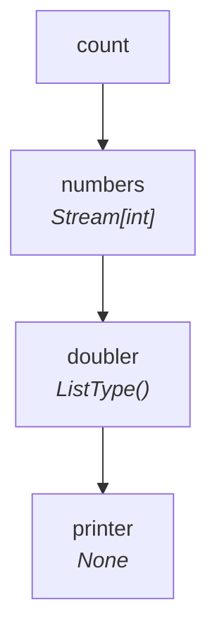
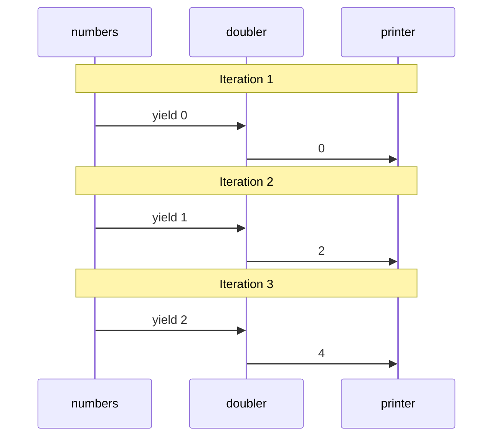
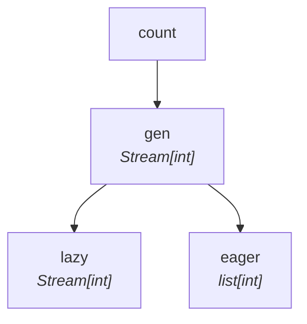

# Lockstep Data Flow

SynaFlow's streaming engine guarantees **extreme memory efficiency** by processing
pipelines in lockstep — one item flows entirely through the DAG before the next
item is produced.

## A Streaming Pipeline

=== "Sync"

    ```python
    from collections.abc import Generator, Iterator
    from typing import NamedTuple
    from synaflow import pipeline, step, run

    class Params(NamedTuple):
        count: int = 3

    def numbers(count: int) -> Generator[int, None, None]:
        yield from range(count)

    def doubler(number: int) -> int:
        return number * 2

    def printer(doubler: Iterator[int]) -> None:
        for x in doubler:
            print(f"Consumed: {x}")

    p = pipeline(
        name="lockstep_demo",
        params=Params,
        steps=[
            step("numbers", fn=numbers),
            step("doubler", fn=doubler),
            step("printer", fn=printer),
        ],
    )

    run(p, Params(count=5))
    ```

=== "Async"

    ```python
    from collections.abc import AsyncGenerator, AsyncIterator
    from typing import NamedTuple
    from synaflow import pipeline, step, async_run

    class Params(NamedTuple):
        count: int = 3

    async def numbers(count: int) -> AsyncGenerator[int, None]:
        for i in range(count):
            yield i

    async def doubler(number: int) -> int:
        return number * 2

    async def printer(doubler: AsyncIterator[int]) -> None:
        async for x in doubler:
            print(f"Consumed: {x}")

    p = pipeline(
        name="lockstep_demo",
        params=Params,
        steps=[
            step("numbers", fn=numbers),
            step("doubler", fn=doubler),
            step("printer", fn=printer),
        ],
    )

    async_run(p, Params(count=5))
    ```

## The DAG

SynaFlow reads the type hints and builds this graph:



Three steps, three execution levels: `numbers` → `doubler` → `printer`.

## How Lockstep Execution Works

The pipeline processes **one item at a time** from start to finish:

| Iteration | `numbers` yields | `doubler` computes | `printer` prints |
|:---------:|:----------------:|:------------------:|:----------------:|
| 1 | `0` | `0 × 2 = 0` | `Consumed: 0` |
| 2 | `1` | `1 × 2 = 2` | `Consumed: 2` |
| 3 | `2` | `2 × 2 = 4` | `Consumed: 4` |
| ... | ... | ... | ... |

Notice: **item 1 is fully processed** (`numbers` → `doubler` → `printer`) before
item 2 is even generated. Only one item lives in memory at any moment.



## Fan-Out: Multiple Consumers

When multiple consumers depend on the same producer, SynaFlow automatically forks
the stream with `itertools.tee` and advances them **together**:



=== "Sync"

    ```python
    def lazy_consumer(gen: Iterator[int]) -> Iterator[int]:
        for x in gen:
            yield x * 10

    def eager_consumer(gen: list[int]) -> int:
        return sum(gen)
    ```

=== "Async"

    ```python
    async def lazy_consumer(gen: AsyncIterator[int]) -> AsyncIterator[int]:
        async for x in gen:
            yield x * 10

    async def eager_consumer(gen: list[int]) -> int:
        return sum(gen)
    ```

- **`lazy_consumer`** receives a lazy fork — streams without holding data.
- **`eager_consumer`** asks for `list[int]` — SynaFlow materializes *only that fork*.

Both consumers receive every item. The lazy fork never holds the full dataset;
only the eager fork does.

## Execution Levels

SynaFlow topologically sorts the DAG into levels. Steps on the same level can
run in parallel (in an async runner):

```python
dag = pipeline_def.dag
print(dag.get_execution_levels())
# [['numbers'], ['doubler'], ['printer']]
```

For a diamond topology, independent branches share a level:

```
       start
      /     \
 branch_a  branch_b
      \     /
       merge

Levels:  ['start']  →  ['branch_a', 'branch_b']  →  ['merge']
```

## When Materialization Happens

| Consumer expects | Behavior |
|---|---|
| `Iterator[T]` | Lazy stream — one item in memory |
| `list[T]` | Full materialization in memory |
| `dict[K,V]` | Materialized from `Iterator[tuple[K,V]]` |
| `set[T]` | Full materialization in memory |

Materialization is **per-branch** — a lazy consumer and an eager consumer
coexist without forcing each other.

## Next

Start building in the [Hello World tutorial](../tutorial/hello-world.md).
