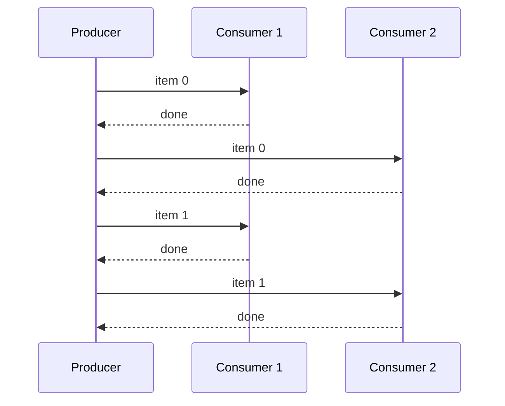

# Lockstep Data Flow

SynaFlow's streaming engine guarantees **extreme memory efficiency** by processing pipelines in lockstep.

## The Problem

In traditional pipeline frameworks, when a producer generates data and multiple consumers need it, you face a dilemma:

- **Hold everything in memory** (e.g., collect to a `list`) → memory spike.
- **Manage `itertools.tee` manually** → complex, error-prone boilerplate.

## SynaFlow's Solution

SynaFlow automatically forks generators using `itertools.tee` and drives all consumers **in lockstep**:

1. The producer yields **one item**.
2. That item is forwarded to the **first consumer**, which processes it.
3. The same item is forwarded to the **second consumer**.
4. Only then does the producer yield the **next item**.

This means only one item is in memory at any given time, regardless of how many consumers exist.



## When Memory Is Fine

If a consumer explicitly requests a `list[T]`, `set[T]`, or `dict[K,V]`, SynaFlow **materializes the entire stream for that specific branch only**. Other branches continue streaming lazily.

=== "Sync"

    ```python
    from collections.abc import Generator, Iterator

    def producer() -> Generator[int, None, None]:
        yield from range(1_000_000)

    def lazy(producer: Iterator[int]) -> None:   # streams, no memory spike
        for x in producer:
            pass

    def eager(producer: list[int]) -> None:      # materialized to list
        print(len(producer))
    ```

=== "Async"

    ```python
    from collections.abc import AsyncGenerator, AsyncIterator

    async def producer() -> AsyncGenerator[int, None]:
        for i in range(1_000_000):
            yield i

    async def lazy(producer: AsyncIterator[int]) -> None:
        async for x in producer:
            pass

    async def eager(producer: list[int]) -> None:
        print(len(producer))
    ```

## Next

Start building your first pipeline in the [Hello World tutorial](../tutorial/hello-world.md).
