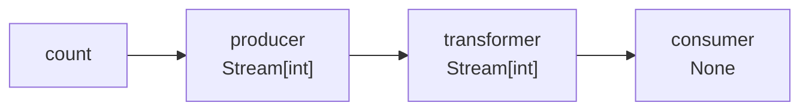
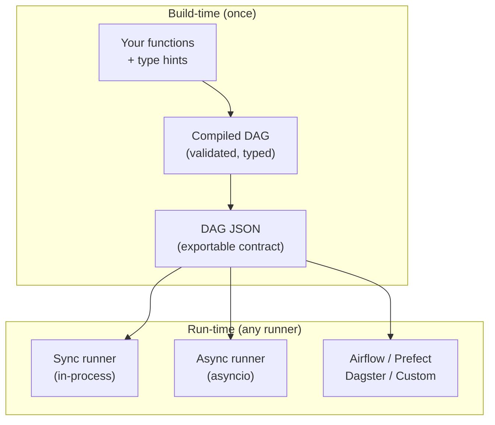

# SynaFlow 🌊🧠

**Write plain Python functions. SynaFlow builds the pipeline for you.**

[](https://pypi.org/project/synaflow/)
[](https://github.com/humansoftware/synaflow/blob/main/LICENSE)
[](https://pypi.org/project/synaflow/)

No `>>` operators. No manual DAG. No `tee` boilerplate. Just type hints and
function names — SynaFlow reads your signatures and wires everything
automatically, streaming data in lockstep with zero memory overhead and an
optional bounded `max_in_flight` window for I/O-bound stages.



=== "Sync"

    ```python
    from collections.abc import Generator, Iterator
    from typing import NamedTuple
    from synaflow import pipeline, step, run, PipelineRegistry


    class Params(NamedTuple):
        count: int

    def producer(count: int) -> Generator[int, None, None]:
        yield from range(count)

    def transformer(producer: Iterator[int]) -> Generator[int, None, None]:
        for val in producer:
            yield val * 10

    def consumer(transformer: Iterator[int]) -> None:
        for x in transformer:
            print(f"Consumed: {x}")

    p = pipeline(
        name="example",
        params=Params,
        steps=[
            step("producer", fn=producer),
            step("transformer", fn=transformer),
            step("consumer", fn=consumer),
        ],
    )
    catalog = PipelineRegistry()
    catalog.add(p)

    run(catalog.get_dag("example"), Params(count=5))
```

    **Output:** `Consumed: 0` · `Consumed: 10` · `Consumed: 20` · `Consumed: 30` · `Consumed: 40`

=== "Async"

    ```python
    from collections.abc import AsyncGenerator, AsyncIterator
    from typing import NamedTuple
    from synaflow import pipeline, step, async_run, PipelineRegistry


    class Params(NamedTuple):
        count: int

    async def producer(count: int) -> AsyncGenerator[int, None]:
        for i in range(count):
            yield i

    async def transformer(producer: AsyncIterator[int]) -> AsyncGenerator[int, None]:
        async for val in producer:
            yield val * 10

    async def consumer(transformer: AsyncIterator[int]) -> None:
        async for x in transformer:
            print(f"Consumed: {x}")

    p = pipeline(
        name="example",
        params=Params,
        steps=[
            step("producer", fn=producer),
            step("transformer", fn=transformer),
            step("consumer", fn=consumer),
        ],
    )
    catalog = PipelineRegistry()
    catalog.add(p)

    async_run(catalog.get_dag("example"), Params(count=5))
```

    **Output:** `Consumed: 0` · `Consumed: 10` · `Consumed: 20` · `Consumed: 30` · `Consumed: 40`

That's the entire API. Three functions, three `step()` calls, zero wiring.
The Mermaid diagram above was auto-generated from the pipeline JSON.

---

### A more realistic pipeline

One producer. Two consumers — one lazy, one eager. Smart binding
(`item` → `items`). Force materialization for an audit log. Error handling.
All in under 30 lines of user code.

=== "Sync"

    ```python
    from collections import Counter
    from collections.abc import Generator, Iterator
    from synaflow import pipeline, step, run, OnError, PipelineRegistry


    class Params(NamedTuple):
        limit: int = 100_000

    def items(limit: int) -> Generator[dict, None, None]:
        for i in range(limit):
            yield {"id": i, "category": "AB"[i % 2], "value": i}

    def normalize(item: dict) -> dict:                # EACH: smart-binds to "items"
        return {**item, "value": item["value"] / 100}

    def live(normalize: Iterator[dict]) -> None:      # lazy — streams 100k items
        for ev in normalize:                          # without ever holding them
            pass

    def batch(normalize: list[dict]) -> dict:          # eager — materializes
        counts = Counter(e["category"] for e in normalize)
        print(f"Totals: {dict(counts)}")
        return counts

    def audit(batch: dict) -> None:                   # force materialize
        pass                                         # persist audit data

    p = pipeline(
        name="realistic",
        params=Params,
        steps=[
            step("items", fn=items),
            step("normalize", fn=normalize),
            step("live", fn=live),
            step("batch", fn=batch),
            step("audit", fn=audit, force_materialize=True),  # persist to disk
        ],
    )
    catalog = PipelineRegistry()
    catalog.add(p)

    run(catalog.get_dag("realistic"), Params(limit=100_000))
```

=== "Async"

    ```python
    from collections import Counter
    from collections.abc import AsyncGenerator, AsyncIterator
    from synaflow import pipeline, step, async_run, OnError, PipelineRegistry


    class Params(NamedTuple):
        limit: int = 100_000

    async def items(limit: int) -> AsyncGenerator[dict, None]:
        for i in range(limit):
            yield {"id": i, "category": "AB"[i % 2], "value": i}

    async def normalize(item: dict) -> dict:
        return {**item, "value": item["value"] / 100}

    async def live(normalize: AsyncIterator[dict]) -> None:
        async for ev in normalize:
            pass

    async def batch(normalize: list[dict]) -> dict:
        counts = Counter(e["category"] for e in normalize)
        print(f"Totals: {dict(counts)}")
        return counts

    async def audit(batch: dict) -> None:
        pass

    p = pipeline(
        name="realistic",
        params=Params,
        steps=[
            step("items", fn=items),
            step("normalize", fn=normalize),
            step("live", fn=live),
            step("batch", fn=batch),
            step("audit", fn=audit, force_materialize=True),
        ],
    )
    catalog = PipelineRegistry()
    catalog.add(p)

    async_run(catalog.get_dag("realistic"), Params(limit=100_000))
```

**What's happening here:**

- `normalize` uses **smart binding** — parameter `item` (singular) auto-binds to step `items`
- `live` receives a **lazy stream** — 100,000 items, zero memory overhead
- `batch` asks for `list[dict]` — **materializes eagerly** for this branch only
- `audit` uses `force_materialize=True` — persists to disk regardless of consumers
- `OnError.CONTINUE` (default) — a corrupt item is silently skipped, pipeline keeps running
- **Same pipeline definition** works in sync and async

No `tee`, no `list()` wrapping, no manual wiring. Five steps, six type hints,
zero boilerplate.

---

## How it fits together



1. **You write plain Python functions** with type hints. That's all.
2. **SynaFlow compiles a validated DAG** at build time — types checked, modes resolved, materializers assigned.
3. **The DAG JSON is the contract** — deterministic, serializable, portable.
4. **Any runner executes it** — in-process sync, in-process async, or export to Airflow/Prefect/Dagster.
   Same pipeline definition, zero code changes.

---

## The problems SynaFlow solves

### 1. Explicit wiring

Without SynaFlow, you'd write:

```python
# Manual DAG: fragile, verbose, doesn't scale
result_a = step_a(params)
result_b = step_b(result_a)
result_c = step_c(result_b)
# Add a new consumer of step_a? Refactor everything.
# Two consumers need step_a? Write itertools.tee yourself.
```

With SynaFlow, you just match names:

```python
def step_a(count: int) -> Generator[int]: ...
def step_b(step_a: int) -> int: ...        # name matches → auto-wired
def step_c(step_b: list[int]) -> None: ...  # name matches → auto-wired
```

Add a step, rename a step, add a second consumer — no rewiring. Type hints
are the graph.

### 2. Memory explosions

Without SynaFlow, sharing a generator between two consumers means:

```python
# Manual tee: easy to get wrong, hard to read
g1, g2 = itertools.tee(producer())
result_a = [x * 2 for x in g1]   # holds everything in memory
result_b = [x + 1 for x in g2]   # also holds everything
```

With SynaFlow, the framework handles it:

```python
def producer() -> Generator[int]: ...

def live(producer: Iterator[int]) -> None:   # lazy — streams, no memory spike
    for x in producer: process(x)

def batch(producer: list[int]) -> int:       # eager — only this branch materializes
    return sum(producer)
```

**One consumer lazy, one eager.** No manual `tee`. No boilerplate. By default
the stream stays lockstep; if you need a bounded window between stages, use
`max_in_flight`. It is especially powerful for I/O-bound pipelines like
`start_request -> await_response`.

### 3. Fine-grained materialization control

Knowing *when* and *where* to persist data mid-pipeline usually means writing
manual I/O inside every function. SynaFlow lets the **consumer decide**:

```python
def stream_me(data: Iterator[T]) -> None:    # no materialization
    ...

def collect_me(data: list[T]) -> None:       # materialize for this branch
    ...

step("checkpoint", fn=expensive, force_materialize=True)  # persist regardless
```

Ask for `Iterator` and it streams. Ask for `list`/`dict`/`set` and it
materializes — **only for that branch**. `force_materialize` persists
intermediate results to disk without changing a line of business logic.

### 4. Telemetry, logging, and error handling

Observers give you a single mental model for monitoring:

```python
def log_metrics(ctx):
    metrics.increment(ctx.step_name, ctx.event.value)

p = pipeline(
    observers=[Observer(log_metrics)],          # pipeline-wide
    steps=[
        step("critical", fn=do_work,
             observers=[Observer(send_alert)]), # per-step override
        step("fragile", fn=parse,
             on_error=OnError.CONTINUE),        # skip bad items
        step("fatal", fn=validate,
             on_error=OnError.STOP),            # halt on failure
    ],
)
```

Observers are fire-and-forget — failures are logged and swallowed, never
affecting pipeline execution. Async handlers are detected and awaited
automatically. Same API in sync and async. No separate monitoring
infrastructure needed.

---

## Who is this for?

- **Data engineers** tired of writing `A >> B >> C` boilerplate in Airflow/Dagster
- **Python developers** who want clean, readable business logic without
  framework noise
- **Anyone processing streams** — events, logs, API responses, database cursors
- **Teams that need sync and async** from the same pipeline definition

---

## How It Compares

| | SynaFlow | Hamilton | Flyte / Metaflow | Dagster / Prefect | Airflow |
|---|---|---|---|---|---|
| **Auto wiring** | ✅ type hints + smart binding | ✅ type hints (exact names) | ❌ explicit `A >> B` | ❌ explicit | ❌ explicit |
| **Lazy streaming** | ✅ lockstep + bounded handoff | ❌ DataFrame-centric | ❌ | ❌ | ❌ |
| **Smart binding** | ✅ singular/plural/suffix | ❌ | ❌ | ❌ | ❌ |
| **Scope** | In-process micro | Feature engineering | Task orchestration | Asset/workflow orchestration | DAG scheduling |
| **DAG export** | ✅ JSON | ✅ | ✅ | ✅ | ✅ |
| **Sync/async parity** | ✅ identical | ❌ | ✅ | ✅ | ❌ |
| **Memory model** | One item per step | Full DataFrame | Task I/O boundary | Task I/O boundary | Task I/O boundary |

SynaFlow is a **micro-orchestrator** — it runs inside a single process. Use
Airflow or Dagster to schedule jobs; use SynaFlow *inside* the job to stream
millions of rows between functions with zero boilerplate.

Because SynaFlow separates **build-time** (DAG compilation) from **run-time**
(execution), you can write custom runners or auto-generate native DAGs for
Airflow, Dagster, or Prefect from the same pipeline definition.
Read more: [Build vs Run](core-concepts/build-vs-run.md) ·
[Resources & Factories](advanced/resources.md) ·
[Testability & Overrides](advanced/testability.md) ·
[Max In Flight](core-concepts/max-in-flight.md) ·
[Export Guidance](advanced/export-guidance.md).

For detailed comparisons: [SynaFlow vs Hamilton](comparisons/hamilton.md) ·
[Java Streams](comparisons/java-streams.md) · [LINQ](comparisons/linq.md)

---

## Start building in 5 minutes

<div style="display:flex;gap:1em;flex-wrap:wrap;margin:1.5em 0">
<div style="flex:1;min-width:200px;background:#24283b;border-radius:8px;padding:1.2em;text-align:center">
<div style="font-size:1.8em;margin-bottom:0.3em">📦</div>
<div style="font-weight:bold;color:#7dcfff;margin-bottom:0.5em">Install</div>
<code style="font-size:0.9em">pip install synaflow</code>
</div>
<div style="flex:1;min-width:200px;background:#24283b;border-radius:8px;padding:1.2em;text-align:center">
<div style="font-size:1.8em;margin-bottom:0.3em">📖</div>
<div style="font-weight:bold;color:#7dcfff;margin-bottom:0.5em">Tutorial</div>
<a href="tutorial/hello-world/" style="font-size:0.9em">Build your first pipeline</a>
</div>
<div style="flex:1;min-width:200px;background:#24283b;border-radius:8px;padding:1.2em;text-align:center">
<div style="font-size:1.8em;margin-bottom:0.3em">🧠</div>
<div style="font-weight:bold;color:#7dcfff;margin-bottom:0.5em">Understand</div>
<a href="core-concepts/how-dag-is-wired/" style="font-size:0.9em">How the DAG is wired</a>
</div>
<div style="flex:1;min-width:200px;background:#24283b;border-radius:8px;padding:1.2em;text-align:center">
<div style="font-size:1.8em;margin-bottom:0.3em">🧪</div>
<div style="font-weight:bold;color:#7dcfff;margin-bottom:0.5em">Testability</div>
<a href="advanced/testability/" style="font-size:0.9em">Runtime overrides</a>
</div>
<div style="flex:1;min-width:200px;background:#24283b;border-radius:8px;padding:1.2em;text-align:center">
<div style="font-size:1.8em;margin-bottom:0.3em">🗄️</div>
<div style="font-weight:bold;color:#7dcfff;margin-bottom:0.5em">Resources</div>
<a href="advanced/resources/" style="font-size:0.9em">Factories and cleanup</a>
</div>
<div style="flex:1;min-width:200px;background:#24283b;border-radius:8px;padding:1.2em;text-align:center">
<div style="font-size:1.8em;margin-bottom:0.3em">📊</div>
<div style="font-weight:bold;color:#7dcfff;margin-bottom:0.5em">Examples</div>
<a href="core-concepts/examples/" style="font-size:0.9em">All corpus pipelines</a>
</div>
</div>
