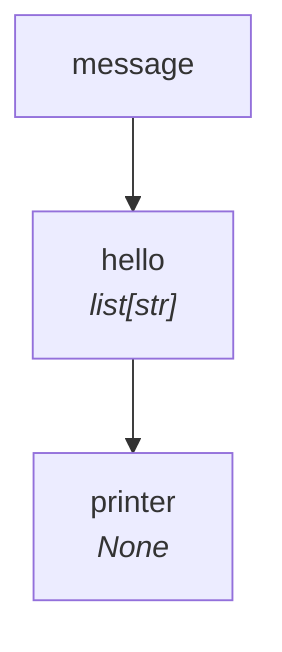

# Tutorial — Level 1: Hello World

Let's build a pipeline step by step. We start with a single step that splits a
message into its individual characters and prints them.

=== "Sync"

    ```python
    from typing import NamedTuple
    from synaflow import pipeline, step, run, PipelineRegistry


    class Params(NamedTuple):
        message: str

    def hello(message: str) -> list[str]:
        return list(message)

    def printer(hello: list[str]) -> None:
        print(hello)

    p = pipeline(
        name="tutorial",
        params=Params,
        steps=[
            step("hello", fn=hello),
            step("printer", fn=printer),
        ],
    )
    catalog = PipelineRegistry()
    catalog.add(p)

    run(catalog.get_dag("tutorial"), Params(message="SynaFlow"))
    # Output: ['S', 'y', 'n', 'a', 'F', 'l', 'o', 'w']
    ```

=== "Async"

    ```python
    import asyncio
    from typing import NamedTuple
    from synaflow import pipeline, step, async_run, PipelineRegistry


    class Params(NamedTuple):
        message: str

    async def hello(message: str) -> list[str]:
        return list(message)

    async def printer(hello: list[str]) -> None:
        print(hello)

    p = pipeline(
        name="tutorial",
        params=Params,
        steps=[
            step("hello", fn=hello),
            step("printer", fn=printer),
        ],
    )
    catalog = PipelineRegistry()
    catalog.add(p)

    asyncio.run(async_run(catalog.get_dag("tutorial"), Params(message="SynaFlow")))
    # Output: ['S', 'y', 'n', 'a', 'F', 'l', 'o', 'w']
    ```

**What happened?**

- `pipeline()` declares the pipeline; `catalog.add(p)` validates and compiles its DAG.
- `run()` / `async_run()` executes it in topological order.
- The param `message: str` is injected into `hello`, which splits it into a list.
- `printer` receives the list and prints it.



## Next

Add a transformation in [Level 2](multiple-steps.md).
