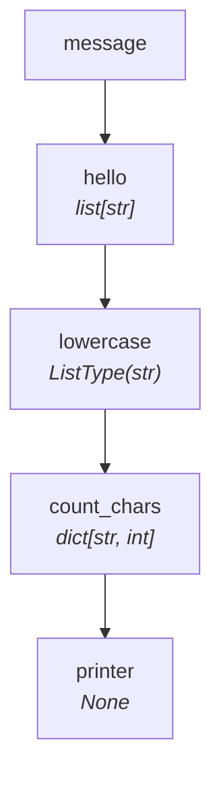

# Tutorial — Level 4: Iterating a Dictionary

Finally, we modify the printer to iterate over each key–value pair individually,
printing one line per character.

=== "Sync"

    ```python
    from collections import Counter
    from typing import NamedTuple
    from synaflow import pipeline, step, run

    class Params(NamedTuple):
        message: str

    def hello(message: str) -> list[str]:
        return list(message)

    def lowercase(hello: str) -> str:
        return hello.lower()

    def count_chars(lowercase: list[str]) -> dict[str, int]:
        return dict(Counter(lowercase))

    def printer(count_chars: dict[str, int]) -> None:
        for char, count in count_chars.items():
            print(f"  {char!r} appears {count} time(s)")

    p = pipeline(
        name="tutorial",
        params=Params,
        steps=[
            step("hello", fn=hello),
            step("lowercase", fn=lowercase),
            step("count_chars", fn=count_chars),
            step("printer", fn=printer),
        ],
    )

    run(p, Params(message="SynaFlow"))
    ```

=== "Async"

    ```python
    from collections import Counter
    from typing import NamedTuple
    from synaflow import pipeline, step, async_run

    class Params(NamedTuple):
        message: str

    async def hello(message: str) -> list[str]:
        return list(message)

    async def lowercase(hello: str) -> str:
        return hello.lower()

    async def count_chars(lowercase: list[str]) -> dict[str, int]:
        return dict(Counter(lowercase))

    async def printer(count_chars: dict[str, int]) -> None:
        for char, count in count_chars.items():
            print(f"  {char!r} appears {count} time(s)")

    p = pipeline(
        name="tutorial",
        params=Params,
        steps=[
            step("hello", fn=hello),
            step("lowercase", fn=lowercase),
            step("count_chars", fn=count_chars),
            step("printer", fn=printer),
        ],
    )

    async_run(p, Params(message="SynaFlow"))
    ```

**Output:**

```
  's' appears 1 time(s)
  'y' appears 1 time(s)
  'n' appears 1 time(s)
  'a' appears 1 time(s)
  'f' appears 1 time(s)
  'l' appears 1 time(s)
  'o' appears 1 time(s)
  'w' appears 1 time(s)
```

**The full pipeline in one view:**



| Step | Input | Output | Mode | Materializes? |
|------|-------|--------|------|---------------|
| `hello` | `message: str` | `list[str]` | ALL | No |
| `lowercase` | `hello: str` | `ListType(str)` | EACH | No (auto-collected) |
| `count_chars` | `lowercase: list[str]` | `dict[str, int]` | ALL | Yes (`list[str]`) |
| `printer` | `count_chars: dict[str, int]` | `None` | ALL | No |

### The complete DAG JSON

```python
print(p.to_dict())
```

```json
{
  "name": "tutorial",
  "params": {"message": "str"},
  "steps": {
    "hello":       {"deps": {"message": "str"},         "output": "list[str]"},
    "lowercase":   {"deps": {"hello": "str"},           "output": "ListType(str)"},
    "count_chars": {"deps": {"lowercase": "list[str]"}, "output": "dict[str, int]"},
    "printer":     {"deps": {"count_chars": "dict[str, int]"}, "output": "None"}
  }
}
```

## Next

Dive deeper into [Core Concepts](../core-concepts/dag-construction.md),
or see the streaming version of this pipeline in [Level 5 — Streaming](streaming.md).
