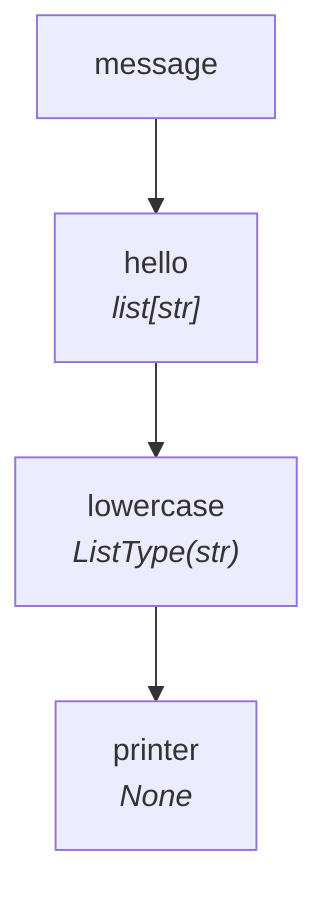

# Tutorial — Level 2: Adding a Transformation

Now we insert a step that converts each character to lowercase. This introduces
**EACH mode** — the step is called once per item.

=== "Sync"

    ```python
    from typing import NamedTuple
    from synaflow import pipeline, step, run, PipelineRegistry


    class Params(NamedTuple):
        message: str


    def hello(message: str) -> list[str]:
        return list(message)


    def lowercase(hello: str) -> str:
        return hello.lower()


    def printer(lowercase: list[str]) -> None:
        print(lowercase)


    p = pipeline(
        name="tutorial",
        params=Params,
        steps=[
            step("hello", fn=hello),
            step("lowercase", fn=lowercase),
            step("printer", fn=printer),
        ],
    )
    catalog = PipelineRegistry()
    catalog.add(p)

    run(catalog.get_dag("tutorial"), Params(message="SynaFlow"))
    # Output: ['s', 'y', 'n', 'a', 'f', 'l', 'o', 'w']
```

=== "Async"

    ```python
    from typing import NamedTuple
    from synaflow import pipeline, step, async_run, PipelineRegistry


    class Params(NamedTuple):
        message: str


    async def hello(message: str) -> list[str]:
        return list(message)


    async def lowercase(hello: str) -> str:
        return hello.lower()


    async def printer(lowercase: list[str]) -> None:
        print(lowercase)


    p = pipeline(
        name="tutorial",
        params=Params,
        steps=[
            step("hello", fn=hello),
            step("lowercase", fn=lowercase),
            step("printer", fn=printer),
        ],
    )
    catalog = PipelineRegistry()
    catalog.add(p)

    async_run(catalog.get_dag("tutorial"), Params(message="SynaFlow"))
    # Output: ['s', 'y', 'n', 'a', 'f', 'l', 'o', 'w']
```

**What happened?**

1. `hello` outputs `list[str]` — a collection of 8 characters.
2. `lowercase` asks for `str` — a **scalar**. Because `hello` outputs an iterable
   and `lowercase` expects a scalar, SynaFlow selects **EACH mode** and calls
   `lowercase` once per character.
3. EACH-mode outputs are automatically collected into a list. `printer` receives
   `list[str]` in **ALL mode** and prints it.



> **EACH mode** wraps the output type in `ListType`. `lowercase` returns `str`
> per item, so its output type is `ListType(str)` — meaning "a list of strings".

You can force the mode explicitly:

```python
step("lowercase", fn=lowercase, mode=StepMode.EACH)
```

## Next

Count the characters in [Level 3](observers.md).
