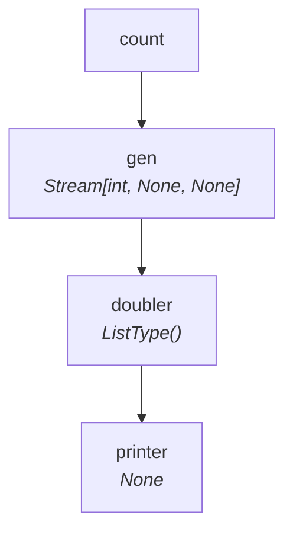

# Tutorial — Level 2: Multiple Steps

Now let's add more steps and watch SynaFlow wire them together based on type hints.

=== "Sync"

    ```python
    from collections.abc import Generator, Iterator
    from typing import NamedTuple
    from synaflow import pipeline, step, run

    class Params(NamedTuple):
        count: int = 3

    def gen(count: int) -> Generator[int, None, None]:
        yield from range(count)

    def doubler(gen: int) -> int:
        return gen * 2

    def printer(doubler: Iterator[int]) -> None:
        for x in doubler:
            print(x)

    p = pipeline(
        name="tutorial",
        params=Params,
        steps=[
            step("gen", fn=gen),
            step("doubler", fn=doubler),
            step("printer", fn=printer),
        ],
    )

    run(p, Params(count=5))
    ```

=== "Async"

    ```python
    from collections.abc import AsyncGenerator, AsyncIterator
    from typing import NamedTuple
    from synaflow import pipeline, step, async_run

    class Params(NamedTuple):
        count: int = 3

    async def gen(count: int) -> AsyncGenerator[int, None]:
        for i in range(count):
            yield i

    async def doubler(gen: int) -> int:
        return gen * 2

    async def printer(doubler: AsyncIterator[int]) -> None:
        async for x in doubler:
            print(x)

    p = pipeline(
        name="tutorial",
        params=Params,
        steps=[
            step("gen", fn=gen),
            step("doubler", fn=doubler),
            step("printer", fn=printer),
        ],
    )

    async_run(p, Params(count=5))
    ```

**What happened?**

1. `gen` produces `Generator[int]` — SynaFlow sees this is a stream.
2. `doubler` asks for `int` — SynaFlow auto-selects **EACH mode** (item-by-item). The stream is unrolled.
3. `printer` asks for `Iterator[int]` — receives the stream lazily.

No `A >> B >> C` wiring. The type hints did all the work.

## Visualizing the DAG

Export the pipeline to JSON and generate a flowchart:

```bash
python scripts/visualize_dag.py --json pipeline.json
```

Generated from the tutorial pipeline:



## Mode: EACH vs ALL

SynaFlow automatically picks the execution mode:

| Consumer expects | Producer outputs | Mode |
|---|---|---|
| `T` (scalar) | `Iterator[T]` (stream) | **EACH** — called per item |
| `Iterator[T]` | `Iterator[T]` | **ALL** — receives whole stream |
| `list[T]` | `Iterator[T]` | **ALL** — stream materialized eagerly |

You can also force the mode explicitly:

```python
step("doubler", fn=doubler, mode=StepMode.EACH)
```

## Next

Attach lifecycle observers in [Level 3](observers.md).
