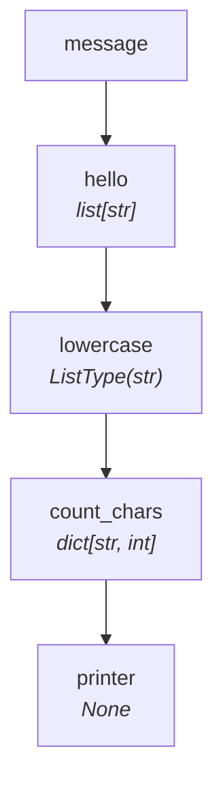

# Tutorial — Level 3: Building a Counter

Now we add a step that receives the full list of characters and counts their
frequencies, producing a dictionary.

=== "Sync"

    ```python
    from collections import Counter
    from typing import NamedTuple
    from synaflow import pipeline, step, run

    class Params(NamedTuple):
        message: str

    def hello(message: str) -> list[str]:
        return list(message)

    def lowercase(hello: str) -> str:
        return hello.lower()

    def count_chars(lowercase: list[str]) -> dict[str, int]:
        return dict(Counter(lowercase))

    def printer(count_chars: dict[str, int]) -> None:
        print(count_chars)

    p = pipeline(
        name="tutorial",
        params=Params,
        steps=[
            step("hello", fn=hello),
            step("lowercase", fn=lowercase),
            step("count_chars", fn=count_chars),
            step("printer", fn=printer),
        ],
    )

    run(p, Params(message="SynaFlow"))
    # Output: {'s': 1, 'y': 1, 'n': 1, 'a': 1, 'f': 1, 'l': 1, 'o': 1, 'w': 1}
    ```

=== "Async"

    ```python
    from collections import Counter
    from typing import NamedTuple
    from synaflow import pipeline, step, async_run

    class Params(NamedTuple):
        message: str

    async def hello(message: str) -> list[str]:
        return list(message)

    async def lowercase(hello: str) -> str:
        return hello.lower()

    async def count_chars(lowercase: list[str]) -> dict[str, int]:
        return dict(Counter(lowercase))

    async def printer(count_chars: dict[str, int]) -> None:
        print(count_chars)

    p = pipeline(
        name="tutorial",
        params=Params,
        steps=[
            step("hello", fn=hello),
            step("lowercase", fn=lowercase),
            step("count_chars", fn=count_chars),
            step("printer", fn=printer),
        ],
    )

    async_run(p, Params(message="SynaFlow"))
    # Output: {'s': 1, 'y': 1, 'n': 1, 'a': 1, 'f': 1, 'l': 1, 'o': 1, 'w': 1}
    ```

**What changed?**

- `count_chars` asks for `list[str]` — this forces SynaFlow to **materialize**
  the EACH-mode output from `lowercase` into a concrete list (instead of the
  default lazy stream).
- `printer` receives the `dict[str, int]` directly in **ALL mode**.



### Materialization is per-branch

When `count_chars` asks for `list[str]`, only **this branch** materializes.
If another step consumed `lowercase` as `Iterator[str]`, it would still stream
lazily without holding all items in memory simultaneously.

## Next

Print each key–value pair individually in [Level 4](materializers.md),
or refactor the pipeline to stream everything in
[Level 5 — Streaming](streaming.md).
