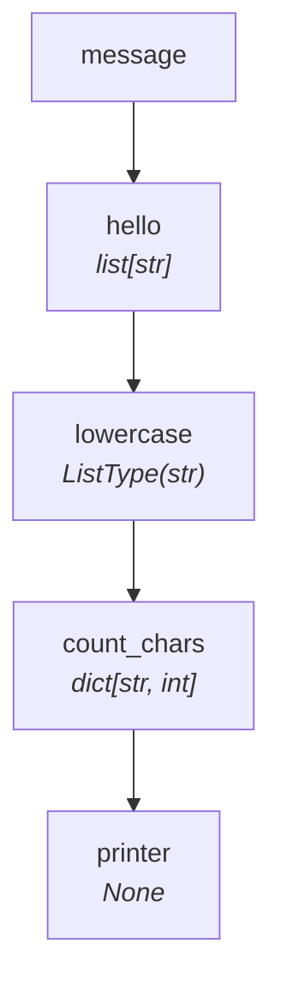
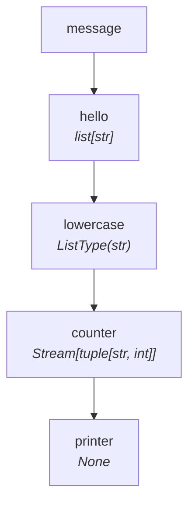

# Tutorial — Level 5: Refactoring to Streaming

The pipeline from Level 4 works, but it materializes the entire character list
into memory (`lowercase → list[str]`). For large datasets, we can refactor to
**stream everything end-to-end** — no materialization at any step.

## The materializing version (Level 4)



- `lowercase` EACH mode → auto-collected into `ListType(str)`
- `count_chars` asks for `list[str]` → **materializes** the full list
- `printer` receives `dict[str, int]` in ALL mode

## The streaming version

Instead of collecting into a list and then a dict, we can:

1. Have `counter` produce a **generator** of `(char, count)` tuples as items flow through.
2. Have `printer` consume the **iterator** of tuples lazily.
3. No collection type (`list`, `dict`) anywhere — zero memory overhead beyond one item.

=== "Sync"

    ```python
    from collections import Counter
    from collections.abc import Generator, Iterator
    from typing import NamedTuple
    from synaflow import pipeline, step, run

    class Params(NamedTuple):
        message: str

    def hello(message: str) -> list[str]:
        return list(message)

    def lowercase(hello: str) -> str:
        return hello.lower()

    def counter(lowercase: Iterator[str]) -> Generator[tuple[str, int], None, None]:
        counts: dict[str, int] = {}
        for char in lowercase:
            counts[char] = counts.get(char, 0) + 1
        for pair in counts.items():
            yield pair

    def printer(counter: Iterator[tuple[str, int]]) -> None:
        for char, count in counter:
            print(f"  {char!r} appears {count} time(s)")

    p = pipeline(
        name="tutorial",
        params=Params,
        steps=[
            step("hello", fn=hello),
            step("lowercase", fn=lowercase),
            step("counter", fn=counter),
            step("printer", fn=printer),
        ],
    )

    run(p, Params(message="SynaFlow"))
    ```

=== "Async"

    ```python
    from collections import Counter
    from collections.abc import AsyncGenerator, AsyncIterator
    from typing import NamedTuple
    from synaflow import pipeline, step, async_run

    class Params(NamedTuple):
        message: str

    async def hello(message: str) -> list[str]:
        return list(message)

    async def lowercase(hello: str) -> str:
        return hello.lower()

    async def counter(lowercase: AsyncIterator[str]) -> AsyncGenerator[tuple[str, int], None]:
        counts: dict[str, int] = {}
        async for char in lowercase:
            counts[char] = counts.get(char, 0) + 1
        for pair in counts.items():
            yield pair

    async def printer(counter: AsyncIterator[tuple[str, int]]) -> None:
        async for char, count in counter:
            print(f"  {char!r} appears {count} time(s)")

    p = pipeline(
        name="tutorial",
        params=Params,
        steps=[
            step("hello", fn=hello),
            step("lowercase", fn=lowercase),
            step("counter", fn=counter),
            step("printer", fn=printer),
        ],
    )

    async_run(p, Params(message="SynaFlow"))
    ```

**Output** (identical to Level 4):

```
  's' appears 1 time(s)
  'y' appears 1 time(s)
  'n' appears 1 time(s)
  'a' appears 1 time(s)
  'f' appears 1 time(s)
  'l' appears 1 time(s)
  'o' appears 1 time(s)
  'w' appears 1 time(s)
```

## What changed

| Step | Level 4 (materialized) | Level 5 (streaming) |
|---|---|---|
| `hello` | `list[str]` | `list[str]` (unchanged — input is small) |
| `lowercase` | `str → str` (EACH, auto-collected) | `str → str` (EACH, auto-collected) |
| `counter` | `list[str] → dict[str, int]` (ALL) | `Iterator[str] → Generator[tuple]` (ALL) |
| `printer` | `dict[str, int] → None` (ALL) | `Iterator[tuple] → None` (ALL) |

- **`counter`** now receives a **lazy iterator** instead of a materialized list.
  It accumulates counts in a local dict (internal to the function) and yields
  each key–value pair as a generator.
- **`printer`** consumes the **lazy iterator** of tuples — no dict materialization.
- No `list[str]` or `dict[str, int]` consumer type anywhere downstream of `hello`.

!!! tip "You could also write `printer` in EACH mode"
    Instead of receiving the full `Iterator[tuple[str, int]]` and looping over
    it manually, `printer` could declare `counter: tuple[str, int]`. SynaFlow
    would detect the iterable producer + scalar consumer and run `printer` in
    **EACH mode** — calling it once per tuple, which is exactly what the manual
    loop does. Same result, less boilerplate.



> **Rule of thumb:** let the **consumer** decide. Ask for `Iterator[T]` and
> SynaFlow streams lazily. Ask for `list[T]`, `set[T]`, or `dict[K,V]` and
> SynaFlow materializes — but only for that branch.

## How the pipeline actually runs

It's tempting to picture pipeline execution like a batch script: `hello` runs to
completion, *then* `lowercase` starts, *then* `counter`, *then* `printer`. That
is **not** how SynaFlow works.

Instead, all steps run **continuously and concurrently** — like an assembly
line. One item flows through every step before the next item is even produced:

```
  hello          lowercase       counter         printer
    │                │               │               │
    ├─ 'S' ─────────►│ lower('S') ──►│               │
    │                │               │ (buffering)   │
    ├─ 'y' ─────────►│ lower('y') ──►│               │
    │                │               │ (buffering)   │
    ├─ 'n' ─────────►│ lower('n') ──►│               │
    │                │               │  ...          │
    │                │               │ (all chars    │
    │                │               │  received)    │
    │                │               ├─ ('s',1) ────►│ prints
    │                │               ├─ ('y',1) ────►│ prints
    │                │               ├─ ('n',1) ────►│ prints
    │                │               │  ...          │
```

- `lowercase` starts processing the first character **before** `hello` finishes.
- `counter` accumulates characters in its local dict **as they arrive**.
- `printer` starts printing **as soon as** `counter` yields its first tuple.
- At no point is the entire list of characters held in memory by the framework.

This is the essence of **lockstep streaming** — every step is alive at the same
time, pulling items forward through the DAG. For fan-out (multiple consumers of
the same producer), SynaFlow automatically forks the stream with `itertools.tee`
and advances all consumers together.

If you need a small bounded window instead of strict lockstep, use
[`max_in_flight`](../core-concepts/max-in-flight.md). That is especially useful
for I/O-bound shapes where one step starts work and the next step waits for the
result.

## Next

Explore more streaming patterns in
[Lockstep Data Flow](../core-concepts/lockstep-flow.md).
